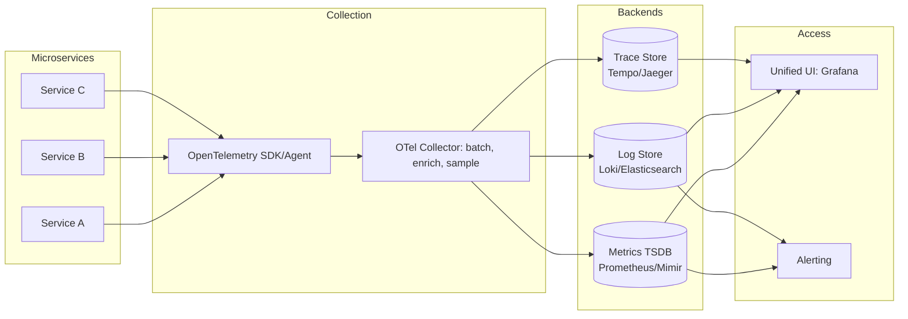
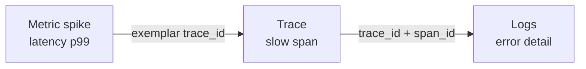
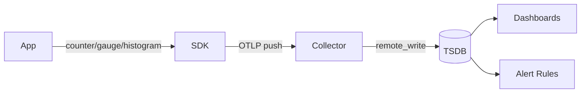
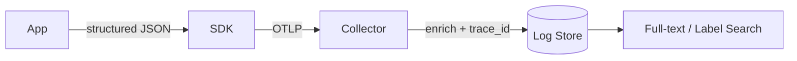
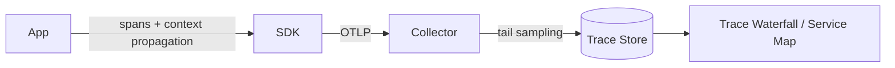
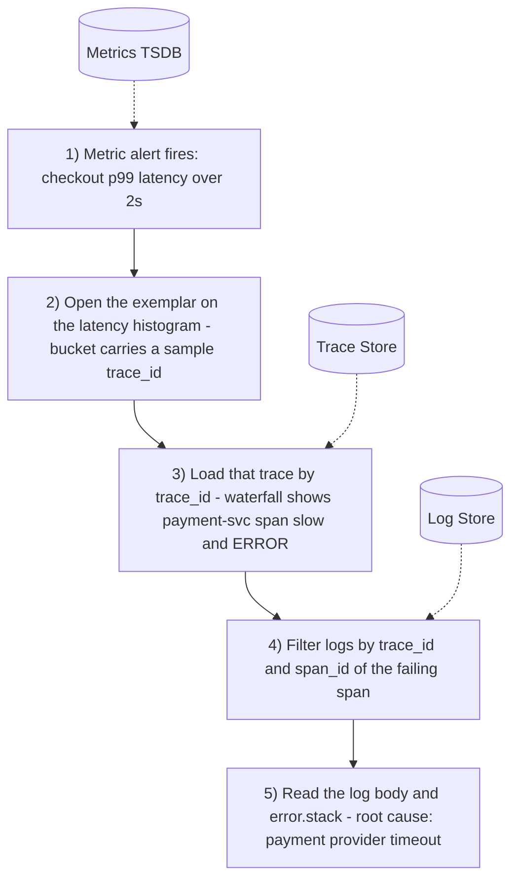

# Centralized Observability for Distributed Microservices

A single system to collect, store, and query the three pillars of telemetry — **metrics**, **logs**, and **traces** — across all services, correlated by shared context (`trace_id`, `service`, `env`).

## Key Concepts

Before the pillar-by-pillar detail, these are the cross-cutting attributes that appear throughout the document and how they relate to one another.

- **Trace** — the full journey of a single request as it moves across services. A trace is not a flat record; it is a **tree of spans** sharing one `trace_id`. The trace answers *"what path did this request take, and where did time go?"*
- **Span** — one unit of work inside a trace (an HTTP handler, a DB query, a message publish). Each span has its own `span_id` and points to its `parent_span_id`, and that parent link is what assembles the individual spans into the trace tree. **Relationship in short: a trace is made of many spans; a span is one node in exactly one trace.**
- **`trace_id`** — the shared identifier stamped on every span **and** every log line produced while handling a request. It is the primary key that lets you pivot between pillars for the same request.
- **`span_id`** — identifies one specific operation within the trace. A log line carrying both `trace_id` and `span_id` can be tied to the exact step that emitted it.
- **Function of a trace in metrics (exemplars)** — metrics are aggregates and carry no `trace_id` on their own. An **exemplar** attaches the `trace_id` of one representative sample to a metric data point (e.g. the request that landed in the p99 latency bucket). This is the bridge that turns a metric spike into a clickable, concrete trace — the only link that connects the metrics pillar to tracing.
- **Resource attributes** — `service.name`, `service.version`, `deployment.environment`, `host`, `k8s.pod`. These are applied identically to all three signal types and provide **aggregate** correlation (line signals up by service and time window) when no `trace_id` is present.
- **Labels vs. attributes** — *labels* are the low-cardinality dimensions indexed on metrics (keep these small); *attributes* are richer key/values attached to logs and spans (higher cardinality is acceptable there).

Rule of thumb: **metrics** tell you *something is wrong*, **traces** tell you *where*, and **logs** tell you *why* — and `trace_id`/`span_id` are what let you move between the three.

## High-Level Architecture



**Correlation principle:** every signal carries a common set of resource attributes (`service.name`, `service.version`, `deployment.environment`, `host`, `k8s.pod`) plus a `trace_id`/`span_id` when available. This lets you pivot metric → trace → log for the same request.



---

## 1. Metrics

Numeric measurements sampled over time. Low cardinality, cheap to store, ideal for dashboards, SLOs, and alerting.



### Attributes

| Attribute | Type | Description |
|---|---|---|
| `name` | string | Metric identifier, e.g. `http_server_request_duration_seconds` |
| `type` | enum | `counter`, `gauge`, `histogram`, `summary` |
| `value` | number | Sampled measurement |
| `timestamp` | int64 | Sample time (unix ns) |
| `unit` | string | `s`, `bytes`, `requests`, `%` |
| `service.name` | label | Owning service |
| `deployment.environment` | label | `prod`, `staging`, `dev` |
| `host` / `k8s.pod` | label | Source instance |
| `endpoint` / `http.route` | label | Dimension for slicing |
| `status_code` | label | Success/error breakdown |
| `exemplar.trace_id` | link | Sample trace tied to a bucket |

### Schema (shape)

```js
{
  name: "http_server_request_duration_seconds",
  type: "histogram",                 // counter | gauge | histogram | summary
  value: 0.128,
  timestamp: 1719830400000000000,    // unix ns
  unit: "s",
  labels: {                          // low-cardinality only
    service_name: "checkout",
    service_version: "1.4.2",
    deployment_environment: "prod",
    host: "node-12",
    k8s_pod: "checkout-7d9f-abc",
    http_route: "/checkout",
    status_code: 200
  },
  exemplar: {                         // optional pointer to a sample trace
    trace_id: "4bf92f3577b34da6a3ce929d0e0e4736",
    value: 0.128
  }
}
```

### Features Enabled

- **SLOs & error budgets** (success rate, latency percentiles)
- **Real-time dashboards** and capacity/trend analysis
- **Threshold & anomaly alerting** (fast, cheap to evaluate)
- **Exemplars** to jump from a metric spike to a representative trace

### Indexing for Discovery & Search

- Stored in a **time-series database** as `(metric_name, label_set) → [timestamp, value]`.
- **Inverted index on label keys/values** for fast label matching (`service="A", route="/checkout"`).
- **Time-partitioned** blocks for range queries; downsampled rollups for long retention.
- **Keep cardinality low** — never use high-uniqueness values (user IDs, request IDs) as labels.

---

## 2. Logs

Timestamped, structured event records. Higher volume, rich detail, used for debugging the "why".



### Attributes

| Attribute | Type | Description |
|---|---|---|
| `timestamp` | int64 | Event time (unix ns) |
| `severity` | enum | `TRACE`/`DEBUG`/`INFO`/`WARN`/`ERROR`/`FATAL` |
| `body` / `message` | string | Human-readable message |
| `service.name` | label | Emitting service |
| `deployment.environment` | label | `prod`, `staging`, `dev` |
| `host` / `k8s.pod` | label | Source instance |
| `trace_id` / `span_id` | link | Correlation to a trace |
| `attributes.*` | map | Structured key/values (user, order_id, etc.) |
| `error.stack` | string | Stack trace on failures |

### Schema (shape)

```js
{
  timestamp: 1719830400000000000,    // unix ns
  severity: "ERROR",                 // TRACE|DEBUG|INFO|WARN|ERROR|FATAL
  body: "payment authorization failed",
  resource: {                        // shared correlation attributes
    service_name: "payment",
    deployment_environment: "prod",
    host: "node-12",
    k8s_pod: "payment-5f8c-xyz"
  },
  trace_id: "4bf92f3577b34da6a3ce929d0e0e4736",  // correlation
  span_id: "00f067aa0ba902b7",
  attributes: {                      // structured, arbitrary cardinality
    order_id: "ord_9981",
    user_id: "u_4432",
    payment_provider: "stripe"
  },
  error: {
    type: "AuthorizationError",
    stack: "AuthorizationError: declined\n  at charge()..."
  }
}
```

### Features Enabled

- **Root-cause debugging** with full contextual detail
- **Trace-to-log pivot** via `trace_id` (see exactly what a slow request logged)
- **Ad-hoc investigation** and pattern/error mining
- **Audit trails** and security forensics

### Indexing for Discovery & Search

- Two common models:
  - **Label-indexed + full-text scan** (Loki): index only low-cardinality labels (`service`, `level`, `env`); the log body is compressed and grep-scanned within matched streams — cheap storage, slower text search.
  - **Full inverted index** (Elasticsearch): tokenize `body` and index selected fields for fast full-text and field queries — richer search, higher cost.
- **Time-partitioned** indices with retention/tiering (hot → warm → cold).
- Index `trace_id` as a keyword field to enable direct trace correlation lookups.

---

## 3. Traces

End-to-end record of a request as it flows across services. A trace is a tree of **spans**.

```mermaid
gantt
    title Trace: POST /checkout (trace_id abc123)
    dateFormat X
    axisFormat %s
    section gateway
    span root        :0, 120
    section order-svc
    validate         :10, 30
    section payment-svc
    charge card      :45, 60
    section db
    write order      :80, 30
```





### Attributes

| Attribute | Type | Description |
|---|---|---|
| `trace_id` | id | Groups all spans of one request |
| `span_id` | id | Unique span identifier |
| `parent_span_id` | id | Builds the span tree |
| `name` | string | Operation, e.g. `GET /users/{id}` |
| `start_time` / `end_time` | int64 | Span timing |
| `duration` | int64 | Derived latency |
| `service.name` | label | Service that produced the span |
| `span.kind` | enum | `server`, `client`, `producer`, `consumer`, `internal` |
| `status` | enum | `OK`, `ERROR` |
| `attributes.*` | map | `http.method`, `db.statement`, `messaging.system`, etc. |
| `events[]` | list | Timestamped span events (incl. exceptions) |

### Schema (shape)

```js
{
  trace_id: "4bf92f3577b34da6a3ce929d0e0e4736",
  span_id: "00f067aa0ba902b7",
  parent_span_id: "0a1b2c3d4e5f6071",  // null for the root span
  name: "POST /checkout",
  start_time: 1719830400000000000,     // unix ns
  end_time:   1719830400120000000,
  duration: 120000000,                 // ns (derived)
  kind: "server",                      // server|client|producer|consumer|internal
  status: "ERROR",                     // OK|ERROR
  resource: {
    service_name: "gateway",
    deployment_environment: "prod"
  },
  attributes: {
    http_method: "POST",
    http_route: "/checkout",
    http_status_code: 500,
    db_statement: "INSERT INTO orders ..."
  },
  events: [                            // point-in-time events within the span
    {
      time: 1719830400115000000,
      name: "exception",
      attributes: { type: "TimeoutError", message: "payment-svc timeout" }
    }
  ]
}
```

### Features Enabled

- **Latency breakdown** across services (find the slow hop)
- **Service dependency maps** and topology discovery
- **Error localization** — which span in the chain failed
- **Critical-path analysis** and bottleneck detection

### Indexing for Discovery & Search

- Primary key: **`trace_id`** for full-trace retrieval (fast key-value lookup).
- **Secondary indexes** on searchable span fields: `service.name`, `name`, `duration`, `status`, `http.status_code`, key `attributes.*`.
- **Tail-based sampling** at the collector keeps interesting traces (errors, slow) and drops noise, controlling volume.
- **Time-partitioned** storage; index duration/status to support "slow + errored traces in last 1h" queries.

---

## Cross-Pillar Correlation

Correlation is what turns three separate data stores into one observability system. Each pillar answers a different question, and correlation is the ability to **carry the same identifiers across all three** so you can jump from one to the next without guessing.

- **Metrics** → *is something wrong?* (a graph crosses a threshold)
- **Traces** → *where is it wrong?* (which service/span on the request path)
- **Logs** → *why is it wrong?* (the exact error, values, and stack)

### The shared keys that make it work

Correlation only works if every signal is stamped with the same identifiers at emission time. There are two kinds:

| Key | Emitted on | What it links |
|---|---|---|
| `trace_id` | traces, logs, metric exemplars | All telemetry produced while handling **one specific request** |
| `span_id` | traces, logs | Telemetry produced during **one specific operation** within that request |
| `service.name` | all three | All telemetry from **one service** |
| `deployment.environment` | all three | Scopes everything to `prod` / `staging` / `dev` |
| `timestamp` | all three | Aligns signals on the **same time window** |

The first two (`trace_id`, `span_id`) give **exact, per-request** correlation. The last three give **aggregate** correlation when no trace id is available (e.g. jumping from a service's dashboard to its logs for the last 5 minutes).

#### `trace_id` vs `span_id`, by example

- **`trace_id`** — a single id for the **whole request** as it travels across services. Every span and every log line produced while handling that request shares the same `trace_id`.
- **`span_id`** — a unique id for **one operation** within that request (a service call, a DB query, etc.). A request has many span_ids but only one trace_id. `parent_span_id` links spans into a tree.

Example — one `POST /checkout` request fanning out across services:

```text
trace_id = 4bf92f3577b34da6a3ce929d0e0e4736   (identical for every step below)

span_id   operation                     parent_span_id
--------  ----------------------------  --------------
00f0..a1  POST /checkout   (gateway)    (none)          <- root span
00f0..b2  validate order   (order-svc)  00f0..a1
00f0..c3  charge card      (payment)    00f0..a1
00f0..d4  INSERT order     (db)         00f0..c3
```

How to read it: all four operations belong to trace `4bf9...` (one request). Each has its own `span_id`, and `parent_span_id` nests them — the DB insert (`d4`) ran inside the charge-card span (`c3`), which ran inside the root gateway span (`a1`). A log line written while charging the card carries `trace_id=4bf9...` **and** `span_id=00f0..c3`, so you can jump straight to the exact step that produced it.

### How the jumps actually happen



**Why each hop is possible:**

1. **Metric → Trace.** A raw metric has no `trace_id` (it's an aggregate). The bridge is an **exemplar**: when the histogram records a slow sample, it attaches the `trace_id` of *that* request to the bucket. Clicking the exemplar hands you a concrete trace that represents the spike.
2. **Trace → Log.** The trace tells you the failing `span_id`. Because your logging is instrumented to emit `trace_id` and `span_id` on every line, you can filter the log store to exactly the lines that span produced — no scrolling through unrelated logs.
3. **Log → Trace.** The reverse also works: find an error log, take its `trace_id`, and open the full trace to see the surrounding request context (what called it, what it called next).
4. **Aggregate fallback.** When there's no trace id (infra metrics, coarse logs), you correlate by `service.name` + `deployment.environment` + the alert's time window to line up the relevant traces and logs.

### Correlation matrix

Read as: *"I'm looking at the row signal and want to pivot to the column signal — here's the key I use."*

| From \ To | → Metrics | → Traces | → Logs |
|---|---|---|---|
| **Metrics** | — | `exemplar.trace_id` on the bucket | via trace, or `service.name` + time window |
| **Traces** | `service.name` + time window | `parent_span_id` (walk the tree) | `trace_id` + `span_id` |
| **Logs** | `service.name` + time window | `trace_id` | `trace_id` (all lines of the request) |

### Requirements to make correlation reliable

- **Context propagation** — inject/extract `trace_id` and `span_id` across every network hop (HTTP headers, message metadata) so the same ids flow end to end.
- **Consistent resource attributes** — apply the same `service.name`, `service.version`, `deployment.environment` conventions to all three signal types (the OTel Collector is a good place to enforce this).
- **Exemplars enabled** on histograms so Metric → Trace jumps are one click.
- **Structured logs** that always include `trace_id`/`span_id` fields, indexed as keywords for fast lookup.
- **Synchronized clocks** (NTP) so time-window correlation across services is trustworthy.
