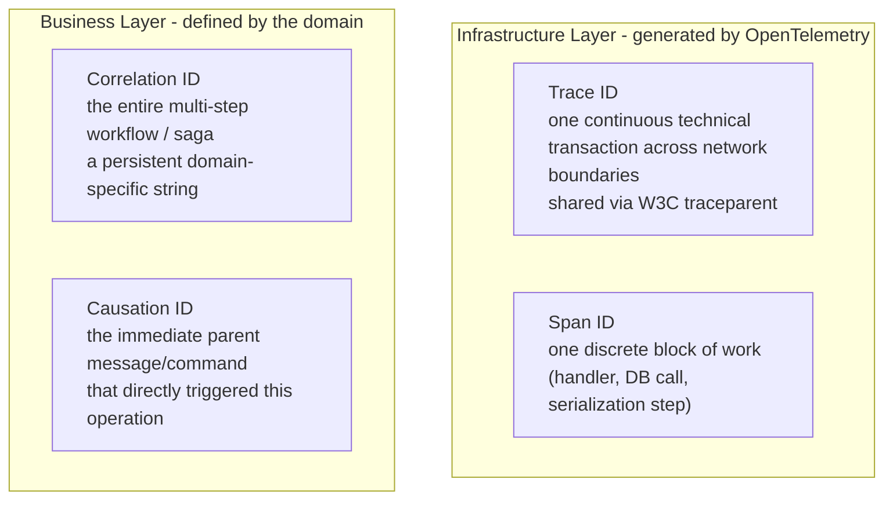
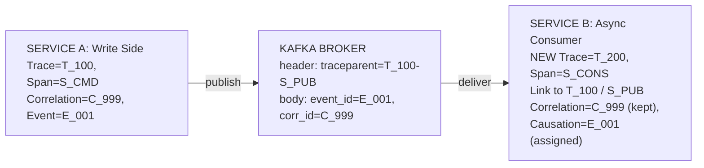
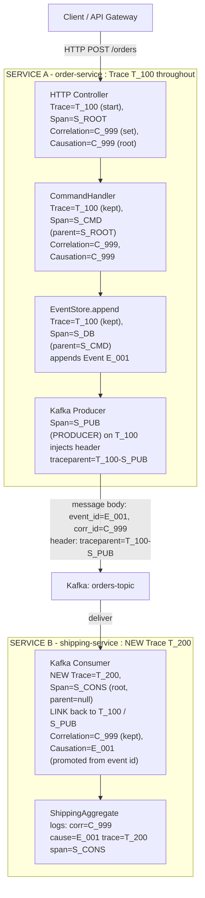
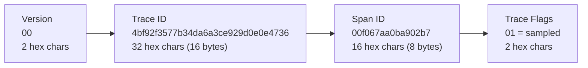
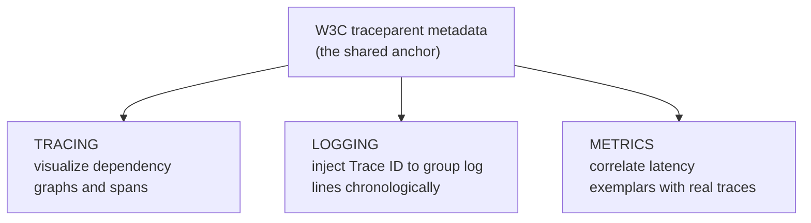

# Data Modeling for Distributed Tracing in Event-Driven DDD Microservices

This document models the observability data for an event-driven, DDD-based microservice system: what to capture inside a service, what to capture across services, how the four correlation identifiers behave over an operation's lifecycle, how to design them, and the concrete field schemas for metrics, logs, and traces.

Two scopes run through the whole document:

- **Service-local (in-process):** signals produced and consumed inside one service boundary.
- **Service-to-service (cross-boundary):** signals that describe how a request or event travels between services over the network or a message broker.

---

# 1. Service-Local (In-Process) Observability

Signals scoped to a single service, describing the health and behavior of its own domain logic and infrastructure.

## 1.1 Metrics

| Signal | What it captures |
|---|---|
| Command latency | Execution time of write-side command handlers, to catch slow domain mutations. |
| Query latency | Read-side execution speed, to catch degraded user-facing performance. |
| Aggregate processing rate | Throughput of state changes processed per Aggregate Root type. |
| Read-model sync lag | Delay between event publication and projection (read-model) database updates. |
| Error rates | Business exceptions (invariant breaks) tracked separately from system failures. |
| Database connection pool | Saturation and utilization of command and query datasource pools. |
| System resource usage | Memory, CPU, and garbage-collection metrics per service instance. |
| Cache hit/miss ratio | Efficiency of query-side cache layers, to optimize database load. |

## 1.2 Logging

| Signal | What it captures |
|---|---|
| Contextual domain metadata | Embeds `aggregateId`, `tenantId`, `commandName`, and `queryName` in every log line. |
| Invariant violation details | Explanatory text and business-rule context when a command is rejected. |
| Structured JSON format | Uniform, machine-readable log records including clean exception stack traces. |
| State-change diff | Debug-level pre- and post-mutation snapshots of an Aggregate. |
| Handler registration | Startup logs verifying commands and queries mapped correctly to handlers. |

## 1.3 Tracing

| Signal | What it captures |
|---|---|
| In-process span boundaries | Dedicated spans around `CommandHandler`, `DomainEventPublisher`, and `QueryHandler` blocks. |
| Database execution spans | Child spans for Event Store appends and read-model updates. |
| Outbox/inbox polling spans | Background worker loops reading transaction-log outbox or inbox tables. |
| Pipeline middleware spans | Validation, logging, authorization, and other cross-cutting behaviors. |

---

# 2. Service-to-Service (Cross-Boundary) Observability

Signals that describe communication *between* services — the broker, the network hop, and the propagation of context across them.

## 2.1 Metrics

| Signal | What it captures |
|---|---|
| Message broker throughput | Messages published and consumed per topic or exchange. |
| Consumer group lag | Unconsumed events backlogged in queues, to flag stuck consumers. |
| Dead-letter queue rate | Volume of unparseable or repeatedly failing messages routed to DLQs. |
| Serialization overhead | Time spent encoding/decoding event payloads at service boundaries. |
| Broker cluster saturation | Disk I/O, memory pressure, and network utilization of broker nodes. |

## 2.2 Logging

| Signal | What it captures |
|---|---|
| Correlation identifiers | `correlationId` for the overall workflow and `causationId` for the direct parent event. |
| Event envelope metadata | Consistent `eventId`, `eventType`, `eventVersion`, and generation timestamp. |
| Broker delivery status | Explicit entries for acknowledgment (ack), negative acknowledgment (nack), or rejection. |
| Schema registry tracking | Validation failures matching payload schemas to active registry versions. |
| Idempotency key audits | Verification logs noting when an event is safely discarded as a duplicate. |

## 2.3 Tracing

| Signal | What it captures |
|---|---|
| Context propagation | Injects/extracts W3C `traceparent` metadata into message transport headers. |
| Asynchronous link spans | Connects consumer traces back to producer traces via OpenTelemetry Links. |
| Batch processing spans | Decoupled, per-message spans when a consumer processes a batch. |
| Network topology mapping | Dynamic dependency graphs computed from spans to visualize the service network. |

---

# 3. The Four Correlation Identifiers

For asynchronous, event-driven cross-service communication, four identifiers work together to solve two distinct problems: tracking the **infrastructure execution graph** and mapping the **business process lineage**.

## 3.1 Conceptual Roles & Ownership

The four IDs split cleanly across two layers — the infrastructure layer (owned and generated by OpenTelemetry) and the business layer (owned and defined by the domain).



- **Trace ID (infrastructure):** tracks a single continuous technical transaction across network boundaries. Generated by tracing libraries and shared via the W3C `traceparent` header.
- **Span ID (infrastructure):** tracks a single discrete block of work (an HTTP handler, a database call, a serialization step) within one service execution context.
- **Correlation ID (business):** groups an entire multi-step workflow or saga (e.g. a checkout flow spanning hours or days) under one persistent, domain-specific identifier.
- **Causation ID (business):** identifies the immediate parent message or command that directly triggered the current operation — a direct cause-and-effect link between consecutive events.

## 3.2 Behavioral Summary Matrix

| ID | Scope / lifecycle | Primary purpose | Logging integration (MDC) | Tracing integration |
|---|---|---|---|---|
| Trace ID | Technical transaction | Performance profiling across physical networks | Injected automatically to group logs chronologically | Core index for APM dependency charts |
| Span ID | Local code block | Isolating localized slow blocks or DB bottlenecks | Injected automatically to isolate execution segments | Tracks span nodes and tree structure |
| Correlation ID | End-to-end domain saga | Auditing whole workflows; troubleshooting async business failures | Injected manually to search every log of a workflow | Custom span attribute (`app.correlation_id`) for filtering |
| Causation ID | Single parent-to-child step | Tracking state mutations; debugging projections; breaking infinite loops | Injected manually to locate the triggering event | Passed in event headers or payload structures |

---

# 4. ID Lifecycle Across an Operation

The system orchestrates these IDs differently depending on whether it is processing internal logic or jumping across service lines over a broker.

## 4.1 Data Lifecycle Across Services (high level)



## 4.2 In-Process (Service-Local) Behavior

- **Trace ID:** stays completely constant.
- **Span ID:** shifts as code enters different components; each sub-operation creates a new child span referencing its parent to build a localized timing hierarchy.
- **Correlation & Causation IDs:** unmodified, flowing through thread-local storage (MDC) so every local log shares the same business context.

## 4.3 Cross-Service Boundary (Asynchronous Broker Hop)

- **Trace ID:** enforces a structural boundary. Because processing an event asynchronously is independent of publishing it, Service B starts a brand-new Trace ID (`T_200`) instead of extending `T_100`, and attaches an OpenTelemetry **Link** back to `T_100` to keep dashboards connected without distorting latency metrics.
- **Span ID:** spawns a brand-new root consumer span (`S_CONS`) with no parent — it is a detached execution thread.
- **Correlation ID:** stays static. It is read from the message body and injected into Service B's logging context so long-term trace aggregation stays intact.
- **Causation ID:** updates dynamically. Service B takes the inbound event's identity (`E_001`) as its local Causation ID, declaring that `E_001` directly triggered its work.

## 4.4 Operation Lifecycle Walkthrough

The diagram walks one operation from the API call, through Service A's in-process spans, across the Kafka boundary, into Service B. Watch which IDs stay constant and which change at the async hop. The overall flow reads top-to-bottom: Service A sits on the first row, then the flow wraps onto a new line after Service A's boundary into the Kafka broker and Service B. Each service's internal steps stack vertically.



**What changed at each step**

| Step | Trace ID | Span ID | Correlation ID | Causation ID |
|---|---|---|---|---|
| A - HTTP Controller | T_100 (new) | S_ROOT | C_999 (set) | C_999 (root) |
| A - CommandHandler | T_100 | S_CMD (child of S_ROOT) | C_999 | C_999 |
| A - EventStore.append | T_100 | S_DB (child of S_CMD) | C_999 | C_999, emits E_001 |
| A - Kafka Producer | T_100 | S_PUB | C_999 | C_999 |
| Broker hop | header carries T_100-S_PUB | - | body carries C_999 | body carries E_001 |
| B - Kafka Consumer | T_200 (new, links T_100) | S_CONS (new root) | C_999 (kept) | E_001 (promoted) |
| B - ShippingAggregate | T_200 | S_CONS | C_999 | E_001 |

## 4.5 Visual Summary of Lifecycle Tracking

- **Correlation ID (`C_999`):** static across both services — it binds all asynchronous logs together.
- **Causation ID (`E_001`):** updates at the boundary — Service B sets its cause to the inbound event's identity.
- **Trace ID (`T_100` → `T_200`):** flips to a new ID at the Kafka boundary, capturing separate runtime executions while staying connected via an OpenTelemetry Link.
- **Span ID (`S_ROOT` → `S_CMD` → `S_DB`):** builds a nesting hierarchy inside Service A to time local classes and database calls.

---

# 5. Designing Readable IDs

## 5.1 Constraint: infrastructure IDs must stay W3C-pure

There is **no** official W3C or OpenTelemetry standard for embedding human-readable prefixes/suffixes into a Trace ID or Span ID — in fact W3C forbids it. A Trace ID must be a random 32-char hex string and a Span ID a 16-char hex string. Forcing non-hex characters (like `order-service-xxx`) into them crashes exporters, breaks collector parsers, and violates the spec.

The readable-ID design is safe to apply **only** to your domain Correlation IDs and Causation IDs, while using standard metadata tags (resource attributes) for infrastructure IDs.

## 5.2 The Recommended Hybrid Blueprint

Split the approach: a **structured string format** for business identifiers, and standard **OpenTelemetry attributes** for technical tracking.

**Business / domain layer (fully customizable strings):**

- Pattern: `[origin-service].[aggregate-type].[unique-slug]`
- Correlation ID (saga root): `order-service.order.cl89z23k10001`
- Causation ID (trigger event): `inventory-service.stock-allocated.cl89z55n40002`

**Infrastructure layer (keep IDs pure, bind attributes):**

- Trace ID: `4bf92f3577b34da6a3ce929d0e0e4736` (random hex)
- Bound resource attributes: `service.name=order-service`, `rpc.method=PlaceOrder`

Modern APM dashboards (Grafana Tempo, Datadog, Jaeger) index these attributes and display the source application directly on the span timeline.

---

# 6. Spring Boot Implementation

## 6.1 Domain ID Factory & Event Envelope

Enforce the prefix convention when commands hit the aggregate boundary.

```java
package com.example.domain;

import java.util.UUID;

public class DomainIdFactory {

    private static final String SERVICE_PREFIX = "order-service";

    // Human-readable correlation ID tied to the originating domain
    public static String generateCorrelationId(String aggregateType) {
        String shortId = UUID.randomUUID().toString().substring(0, 8);
        return String.format("%s.%s.%s", SERVICE_PREFIX, aggregateType, shortId);
    }
}
```

```java
// Standardized event envelope
public record EventEnvelope<T>(
    String eventId,        // e.g. "order-service.order-placed.a1b2c3d4"
    String correlationId,  // e.g. "order-service.order.z9y8x7w6"
    String causationId,    // the exact eventId that caused this
    T payload
) {}
```

## 6.2 Automatic Trace & Service-Name Binding

Spring Boot reads `spring.application.name` and attaches it as a permanent attribute to every raw hex Trace ID.

```yaml
spring:
  application:
    name: order-service
management:
  tracing:
    sampling:
      probability: 1.0
  opentelemetry:
    resource-attributes:
      service.name: ${spring.application.name}
      service.namespace: ecom-domain
```

## 6.3 Combined Logging Pattern

Combining both layers makes logs readable — the originating service is identifiable from either the technical metadata or the domain IDs.

```yaml
logging:
  pattern:
    level: "%5p [app=${spring.application.name}, traceId=%X{traceId}, spanId=%X{spanId}] [corr=%X{correlationId}, cause=%X{causationId}]"
```

Sample output line:

```text
INFO [app=shipping-service, traceId=4bf92f3577b34da6a3ce929d0e0e4736, spanId=00f067aa0ba902b7] [corr=order-service.order.z9y8x7w6, cause=order-service.order-placed.a1b2c3d4] - Successfully synchronized read model.
```

## 6.4 Ingesting a W3C traceparent in a Kafka Consumer

HTTP requests parse the header automatically. For a Kafka consumer you must tell the framework how to read it using an OpenTelemetry propagator.

```java
import io.opentelemetry.api.trace.propagation.W3CTraceContextPropagator;
import io.opentelemetry.context.Context;
import io.opentelemetry.context.propagation.TextMapGetter;
import org.apache.kafka.clients.consumer.ConsumerRecord;
import org.springframework.kafka.annotation.KafkaListener;
import org.springframework.stereotype.Service;

@Service
public class OrderEventTracingConsumer {

    @KafkaListener(topics = "orders-topic")
    public void consume(ConsumerRecord<String, String> record) {

        // Extract the W3C traceparent from the Kafka transport headers
        Context extractedContext = W3CTraceContextPropagator.getInstance().extract(
            Context.current(),
            record,
            new TextMapGetter<>() {
                @Override
                public Iterable<String> keys(ConsumerRecord<String, String> carrier) {
                    return () -> java.util.Arrays.stream(carrier.headers().toArray())
                                                 .map(h -> h.key()).iterator();
                }
                @Override
                public String get(ConsumerRecord<String, String> carrier, String key) {
                    var header = carrier.headers().lastHeader(key);
                    return header != null ? new String(header.value()) : null;
                }
            }
        );

        // This extracted context now ties into logs and metrics automatically
        try (var scope = extractedContext.makeCurrent()) {
            // Event-driven business logic here
        }
    }
}
```

---

# 7. The W3C traceparent

The W3C `traceparent` is a standardized string format for distributed-tracing metadata. It defines exactly how tracing context is formatted when crossing network barriers such as HTTP headers or message-broker properties.

## 7.1 Anatomy of a traceparent Header

A valid header is a hyphen-delimited string of exactly four fields:

```text
traceparent: 00-4bf92f3577b34da6a3ce929d0e0e4736-00f067aa0ba902b7-01
```



- **Version (2 hex):** currently `00`; lets systems parse future updates to the standard.
- **Trace ID (32 hex):** the 16-byte identifier for the entire distributed transaction; identical across services.
- **Span ID (16 hex):** the 8-byte identifier for the specific operation currently executing.
- **Trace Flags (2 hex):** a bitmap where `01` means the trace was sampled (recorded) and `00` means it was not.

## 7.2 Linking the Three Pillars

Though it originates in tracing, the `traceparent` is the shared anchor that links all three pillars of observability.



**Relationship to logging (contextual correlation):** when a request carries a `traceparent`, Micrometer/OpenTelemetry extracts the Trace ID and Span ID into the MDC. Log rows then match traces — copy a Trace ID from a failed-query error log into Jaeger or Zipkin to see the timing chart.

**Relationship to metrics (exemplars):** metrics systems (Prometheus, OpenTelemetry Metrics) attach **exemplars** — a tracing reference on a metric data point. Click the peak of a command-latency spike and it hands you the exact `traceparent` of the real slow request that caused it.

---

# 8. Data Schemas

These schemas model each observability record as it is stored and queried. Field names use **camelCase** (the application/DTO convention); the second line of each *Name* cell gives the **OpenTelemetry semantic-convention key** the field maps to (dotted, lowercase). Fields marked *custom* are domain attributes we define under an `app`/`ddd` namespace because OTel defines no standard for them. Resource-level attributes (`service.*`, `deployment.*`) repeat across all three pillars on purpose — they are the shared join keys for cross-pillar correlation.

## 8.1 Metrics Attributes Schema

| Name | Data Type | Usecase |
|---|---|---|
| `metricName`<br>OTel: metric name (e.g. `messaging.process.duration`) | java.lang.String | Identifies the specific measurement (e.g. `commandLatencySeconds`, `consumerLagCount`). |
| `metricValue`<br>OTel: data-point value | double | The numeric scalar or delta recorded for the telemetry snapshot. |
| `metricType`<br>OTel: instrument kind (`Counter`/`Gauge`/`Histogram`) | java.lang.String (enum) | Instrument type; determines how the value is aggregated over time. |
| `unit`<br>OTel: `unit` (UCUM, e.g. `s`, `By`, `1`) | java.lang.String | Unit of measure; required for correct dashboards and conversions. |
| `timestamp`<br>OTel: `TimeUnixNano` | java.time.Instant | When the data point was recorded. |
| `startTimestamp`<br>OTel: `StartTimeUnixNano` | java.time.Instant | Window start for cumulative sums and histograms. |
| `serviceName`<br>OTel: `service.name` | java.lang.String | Originating Spring Boot microservice (resource attribute). |
| `serviceNamespace`<br>OTel: `service.namespace` | java.lang.String | Logical service grouping / bounded-context cluster. |
| `serviceVersion`<br>OTel: `service.version` | java.lang.String | Deployed build, to correlate regressions with releases. |
| `serviceInstanceId`<br>OTel: `service.instance.id` | java.lang.String | Specific pod/instance emitting the metric. |
| `deploymentEnvironment`<br>OTel: `deployment.environment.name` | java.lang.String | Scopes the metric to prod / staging / dev. |
| `boundedContext`<br>OTel custom: `ddd.bounded_context` | java.lang.String | DDD context the metric belongs to. |
| `aggregateType`<br>OTel custom: `ddd.aggregate.type` | java.lang.String | Links the data to a DDD Aggregate Root (e.g. Order, Inventory). |
| `operationType`<br>OTel custom: `cqrs.operation.type` | java.lang.String (enum) | Segregates write-side (COMMAND) from read-side (QUERY) traffic. |
| `handlerName`<br>OTel: `code.namespace` | java.lang.String | Class name of the executing CQRS command or query handler. |
| `messagingSystem`<br>OTel: `messaging.system` | java.lang.String | Broker type: `kafka` / `rabbitmq`. |
| `messagingDestination`<br>OTel: `messaging.destination.name` | java.lang.String | Target broker topic, queue, or exchange. |
| `consumerGroup`<br>OTel: `messaging.consumer.group.name` | java.lang.String | Consumer group, for lag and throughput slicing. |
| `executionStatus`<br>OTel: `otel.status_code` | java.lang.String (enum) | Outcome: SUCCESS, SYSTEM_ERROR, or BUSINESS_INVARIANT_VIOLATION. |
| `errorType`<br>OTel: `error.type` | java.lang.String | Exception class name, to group failure frequencies. |
| `tenantId`<br>OTel custom: `enduser.tenant.id` | java.lang.String | Multi-tenant slicing (use cautiously — high cardinality). |
| `exemplarTraceId`<br>OTel: exemplar `trace_id` | java.lang.String | Sample Trace ID linking a metric spike to a real trace. |
| `exemplarSpanId`<br>OTel: exemplar `span_id` | java.lang.String | Sample Span ID for the exemplar data point. |

### 8.1.1 Metric Catalog: Name, Type & Unit Reference

The schema above defines the *fields*; this catalog fixes the concrete **`metricName` → `metricType` → `unit`** contract for each measurement we emit. It is the source of truth to avoid drift (two teams naming latency differently or mixing seconds with milliseconds). Best practices applied:

- **Naming:** the app-side name is `camelCase` with a unit suffix (`commandLatencySeconds`); the exported OTel name is dotted, lowercase, and **unit-free** (`command.latency`) because the unit travels in the `unit` field, not the name.
- **Instrument type:** pick per semantics — `Counter` (monotonic totals), `UpDownCounter` (values that rise and fall), `Gauge` (instantaneous snapshots), `Histogram` (distributions you want percentiles on).
- **Unit:** always a **UCUM** code — `s` (seconds), `By` (bytes), `1` (dimensionless ratio/utilization), and annotation units like `{request}` or `{message}` for countable things that have no physical unit.

| `metricName` (app / OTel) | `metricType` | `unit` (UCUM) | `metricValue` meaning |
|---|---|---|---|
| `commandLatencySeconds`<br>`command.latency` | Histogram | `s` | Wall-clock duration of a CQRS command handler; drives p50/p95/p99. |
| `queryLatencySeconds`<br>`query.latency` | Histogram | `s` | Duration of a read-side query handler. |
| `requestCount`<br>`http.server.request.count` | Counter | `{request}` | Monotonic total of inbound requests handled. |
| `errorCount`<br>`error.count` | Counter | `{error}` | Monotonic total of failures, split by `errorType`/`executionStatus`. |
| `businessInvariantViolations`<br>`ddd.invariant.violations` | Counter | `{violation}` | Domain rule breaks, tracked apart from system errors. |
| `eventsAppended`<br>`eventstore.events.appended` | Counter | `{event}` | Domain events written to the event store. |
| `messagesPublished`<br>`messaging.published` | Counter | `{message}` | Broker messages produced to a topic/exchange. |
| `messageProcessingSeconds`<br>`messaging.process.duration` | Histogram | `s` | Time to consume and process one broker message. |
| `consumerLagCount`<br>`messaging.consumer.lag` | Gauge | `{message}` | Current backlog of unconsumed messages for a consumer group. |
| `dbConnectionsActive`<br>`db.client.connections.usage` | UpDownCounter | `{connection}` | Connections currently checked out of the pool (rises and falls). |
| `dbConnectionPoolUtilization`<br>`db.client.connections.utilization` | Gauge | `1` | Pool saturation as a 0–1 ratio. |
| `cacheHitRatio`<br>`cache.hit.ratio` | Gauge | `1` | Query-side cache efficiency as a 0–1 ratio. |
| `jvmMemoryUsedBytes`<br>`jvm.memory.used` | UpDownCounter | `By` | Heap/non-heap memory in use per instance. |
| `cpuUtilization`<br>`system.cpu.utilization` | Gauge | `1` | Fraction of CPU in use (0–1) per service instance. |
| `gcPauseSeconds`<br>`jvm.gc.duration` | Histogram | `s` | Garbage-collection pause durations. |

## 8.2 Logging Attributes Schema

| Name | Data Type | Usecase |
|---|---|---|
| `timestamp`<br>OTel: `Timestamp` (TimeUnixNano) | java.time.Instant | When the event actually occurred. |
| `observedTimestamp`<br>OTel: `ObservedTimestamp` | java.time.Instant | When the pipeline/collector observed the record (ordering fallback). |
| `severityText`<br>OTel: `SeverityText` | java.lang.String | Human severity label (INFO, WARN, ERROR, DEBUG). |
| `severityNumber`<br>OTel: `SeverityNumber` | int (1–24) | Numeric severity for range filtering consistently across languages. |
| `body`<br>OTel: `Body` | java.lang.String | The human-readable log message payload. |
| `eventName`<br>OTel: `event.name` | java.lang.String | Stable identifier for structured/semantic log events. |
| `serviceName`<br>OTel: `service.name` | java.lang.String | Microservice context that generated the record (resource). |
| `serviceVersion`<br>OTel: `service.version` | java.lang.String | Build/release of the emitter. |
| `serviceInstanceId`<br>OTel: `service.instance.id` | java.lang.String | Pod/instance that produced the record. |
| `deploymentEnvironment`<br>OTel: `deployment.environment.name` | java.lang.String | prod / staging / dev scope. |
| `threadName`<br>OTel: `thread.name` | java.lang.String | Active thread, to isolate parallel-execution issues. |
| `loggerName`<br>OTel: `code.namespace` | java.lang.String | Fully qualified Java class executing the logging statement. |
| `traceId`<br>OTel: `TraceId` | java.lang.String | Joins the log row to its matching distributed trace. |
| `spanId`<br>OTel: `SpanId` | java.lang.String | Pinpoints the exact span enclosing this log statement. |
| `traceFlags`<br>OTel: `TraceFlags` | int | Sampling bitmap (whether the trace was recorded). |
| `correlationId`<br>OTel: `messaging.message.conversation_id` | java.lang.String | Statically groups all async logs of one multi-service saga. |
| `causationId`<br>OTel custom: `app.causation_id` | java.lang.String | Immediate parent command/event id that triggered this row. |
| `messageId`<br>OTel: `messaging.message.id` | java.lang.String | Message identity (idempotency + join to publish/process spans). |
| `eventType`<br>OTel custom: `event.type` | java.lang.String | Domain/integration event name (e.g. OrderCreated). |
| `aggregateId`<br>OTel custom: `ddd.aggregate.id` | java.lang.String | Domain entity instance the log concerns. |
| `tenantId`<br>OTel custom: `enduser.tenant.id` | java.lang.String | Isolates logs per client in multi-tenant systems. |
| `exceptionType`<br>OTel: `exception.type` | java.lang.String | Exception class name of a failure. |
| `exceptionMessage`<br>OTel: `exception.message` | java.lang.String | Failure message text. |
| `exceptionStackTrace`<br>OTel: `exception.stacktrace` | java.lang.String | Serialized Java stack dump during system errors. |

## 8.3 Tracing Attributes Schema

| Name | Data Type | Usecase |
|---|---|---|
| `traceId`<br>OTel: `TraceId` | java.lang.String | Universally ties an entire multi-service distributed transaction together. |
| `spanId`<br>OTel: `SpanId` | java.lang.String | Identifies a single internal execution block or external network hop. |
| `parentSpanId`<br>OTel: `ParentSpanId` | java.lang.String | Builds parent-child span-tree topology within a trace. |
| `traceState`<br>OTel: `TraceState` (W3C `tracestate`) | java.lang.String | Vendor-specific propagation key/values alongside `traceparent`. |
| `spanName`<br>OTel: `Name` | java.lang.String | Operation label (e.g. `validateOrder`, `publish orders.created`). |
| `spanKind`<br>OTel: `SpanKind` | java.lang.String (enum) | CLIENT / SERVER / PRODUCER / CONSUMER / INTERNAL. |
| `startTime`<br>OTel: `StartTimeUnixNano` | java.time.Instant | Timestamp marking the launch of the tracked operation. |
| `endTime`<br>OTel: `EndTimeUnixNano` | java.time.Instant | Timestamp marking completion of the tracked operation. |
| `durationNanoseconds`<br>OTel: derived (`EndTime − StartTime`) | long | Execution lifespan, used to flag performance bottlenecks. |
| `statusCode`<br>OTel: `Status.Code` | java.lang.String (enum) | Span outcome: UNSET, OK, or ERROR. |
| `statusMessage`<br>OTel: `Status.Message` | java.lang.String | Human-readable description when status is ERROR. |
| `serviceName`<br>OTel: `service.name` | java.lang.String | Node executing the code, to render service maps (resource). |
| `serviceVersion`<br>OTel: `service.version` | java.lang.String | Build/release of the span emitter. |
| `deploymentEnvironment`<br>OTel: `deployment.environment.name` | java.lang.String | prod / staging / dev scope. |
| `spanLinks`<br>OTel: `Links` (list of {traceId, spanId}) | java.util.List | Cross-trace references for async fan-out/batch (replaces the single `traceLinkId`). |
| `spanEvents`<br>OTel: `Events` (incl. `exception`) | java.util.List | Timestamped in-span events (exceptions, retries, dead-letter). |
| `correlationId`<br>OTel: `messaging.message.conversation_id` | java.lang.String | Bridges the infra trace to the business saga. |
| `causationId`<br>OTel custom: `app.causation_id` | java.lang.String | Direct cause — the parent message id that triggered this span. |
| `messagingSystem`<br>OTel: `messaging.system` | java.lang.String | Broker type: `kafka` / `rabbitmq`. |
| `messagingDestination`<br>OTel: `messaging.destination.name` | java.lang.String | Topic / queue / exchange the span acts on. |
| `messagingOperation`<br>OTel: `messaging.operation.type` | java.lang.String (enum) | publish / receive / process / settle. |
| `messageId`<br>OTel: `messaging.message.id` | java.lang.String | Message identity for loss/duplicate detection. |
| `aggregateType`<br>OTel custom: `ddd.aggregate.type` | java.lang.String | DDD Aggregate Root the span operates on. |
| `aggregateId`<br>OTel custom: `ddd.aggregate.id` | java.lang.String | Aggregate instance id. |
