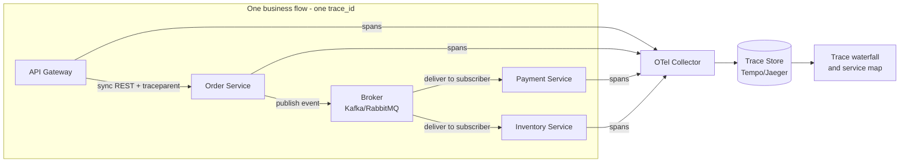
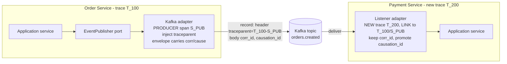

# Distributed Tracing in an Event-Driven Microservices System

> **What this document is.** A single, self-contained *technical reference* for distributed
> tracing across an event-driven, DDD-based microservices platform. It states the tracing
> **requirements** the platform must satisfy, then specifies how to meet them: concepts → a
> precise *what-to-trace* specification → a Spring Boot + Kafka/RabbitMQ implementation →
> operating guidance → the design rationale behind it all.
>
> **Companion document.** [`data_modeling.md`](./data_modeling.md) is the source of truth for the
> **field-level schemas** (metrics, logs, traces), the **four correlation identifiers**, and the
> **readable-ID design**. This document references those schemas rather than duplicating them and
> uses the same attribute names throughout.

## Contents

- **Part I — Concepts, Scope & Requirements**
  - [1. Overview](#1-overview)
  - [2. Functional flow](#2-functional-flow)
  - [3. Scope](#3-scope)
  - [4. Command vs. event — traced differently](#4-command-vs-event--traced-differently)
  - [5. Requirements](#5-requirements)
- **Part II — What to Trace (specification)**
  - [6. Correlation identifiers and keys every span MUST carry](#6-correlation-identifiers-and-keys-every-span-must-carry)
  - [7. Traced boundaries and span shapes](#7-traced-boundaries-and-span-shapes)
  - [8. Message loss, delivery-failure, outbox, idempotency & retry tracing](#8-message-loss-delivery-failure-outbox-idempotency--retry-tracing)
- **Part III — Implementation (Spring Boot + Kafka/RabbitMQ)**
  - [9. The core idea: context travels with the message](#9-the-core-idea-context-travels-with-the-message)
  - [10. Building blocks and clean-architecture placement](#10-building-blocks-and-clean-architecture-placement)
  - [11. Event envelope schema](#11-event-envelope-schema)
  - [12. Dependencies and configuration](#12-dependencies-and-configuration)
  - [13. What the message looks like on the wire](#13-what-the-message-looks-like-on-the-wire)
  - [14. Producer adapter](#14-producer-adapter)
  - [15. Consumer adapter](#15-consumer-adapter)
  - [16. Messaging & domain span attributes (semantic conventions)](#16-messaging--domain-span-attributes-semantic-conventions)
  - [17. Collector](#17-collector)
- **Part IV — Operating Guidance**
  - [18. Best practices (consolidated)](#18-best-practices-consolidated)
  - [19. Definition of done (per service)](#19-definition-of-done-per-service)
- **Part V — Design Rationale**
  - [20. Why domain-model observability, and what kind](#20-why-domain-model-observability-and-what-kind)
  - [21. How trace/log/metric work across services vs. per service](#21-how-tracelogmetric-work-across-services-vs-per-service)

---

# Part I — Concepts, Scope & Requirements

## 1. Overview

**Distributed tracing** follows a single logical operation (one user request or one business
flow) as it travels across many services, and records it as one connected **trace**. Each unit
of work along the way becomes a **span**; all spans share one `trace_id`, and each points at its
caller via `parent_span_id`, so the backend can reassemble them into a tree that shows exactly
where time was spent and where a failure occurred.

| Term | Meaning |
|---|---|
| **Trace** | The whole journey of one operation across services (one `trace_id`). |
| **Span** | One step in that journey — a request handler, a message publish, or a message consumer. Has its own `span_id` and a `parent_span_id`. |
| **Context propagation** | The mechanism that carries `trace_id`/`span_id` from one service to the next (W3C `traceparent` header over HTTP, or message headers over a broker) so the trace stays connected. |

## 2. Functional flow



Each service creates its spans locally and exports them independently to the collector. Because
every span carries the shared `trace_id` — propagated over the REST hop — and every async span
carries the shared `messaging.message.conversation_id`, the backend groups them back into a
single trace (or a linked set of traces) and renders the waterfall and service map. No service
needs to know the full picture.

## 3. Scope

This document is deliberately narrow. It covers **only**:

- **Service-to-service** distributed tracing — the network hop between two of our services.
- **EDA message tracing** — publishers and subscribers of **command** messages and **event** messages.
- **Delivery-integrity** tracing — message loss, dead-lettering, transactional outbox, idempotency, and retries.

**Out of scope (intentionally):**

- *Client-side tracing* — browser/mobile (RUM) and calls to backing resources such as databases, caches, and third-party APIs.
- *Internal tracing* — in-process spans for business-logic/use-case methods and background jobs. (The service-local signals are catalogued in [`data_modeling.md` §1](./data_modeling.md).)

## 4. Command vs. event — traced differently

The single most important modeling decision in EDA tracing is that commands and events produce
different span shapes.

| | **Command** | **Event** |
|---|---|---|
| Meaning | Imperative "do this" | Fact "this happened" |
| Consumers | Exactly **one** handler | **Zero or more** subscribers |
| Example | `ChargePayment` | `OrderCreated` |
| Trace shape | Parent → child (same `trace_id`, directed) | New root trace per subscriber, **linked** back to the publish span (fan-out) |
| Loss signal | The one handler span is missing | A given subscriber's span is missing |

> **Why events start a new trace.** Consuming an event asynchronously is independent of publishing
> it. Extending the producer's trace would distort latency (the consumer might run seconds later),
> so each subscriber starts a **new `trace_id`** and attaches an OpenTelemetry **Link** back to the
> publish span. The shared `messaging.message.conversation_id` keeps the whole saga joinable across
> those separate traces. See [`data_modeling.md` §4.3](./data_modeling.md) for the full lifecycle.

## 5. Requirements

This reference specifies the tracing capabilities the platform must provide. Requirements are
grouped by concern; each links to the section that defines how it is met. Treat this as the
acceptance surface for any service's instrumentation.

### 5.1 Context & correlation (foundation)

| ID | Requirement | Specified in |
|---|---|---|
| **CR-1** | W3C `traceparent`/`tracestate` propagated on **every** HTTP hop and **every** broker hop (inject on send, extract on receive). | §7, §9, §13–§15 |
| **CR-2** | Command spans modeled parent-child (same trace); event spans modeled as a new root trace **linked** to the publish span. | §4, §7, §15 |
| **CR-3** | Every messaging span, log line, and message envelope carries the **four correlation identifiers** — `trace_id`, `span_id`, `correlationId` (`messaging.message.conversation_id`), `causationId` (`app.causation_id`) — plus `messaging.message.id`. | §6, §11 |
| **CR-4** | **Three-pillar correlation**: `trace_id`/`span_id` injected into the log MDC, and **exemplars** attached to messaging metrics so a metric spike links to a real trace. | §6, §18, [`data_modeling.md` §7.2](./data_modeling.md) |

### 5.2 Domain (DDD) fit

| ID | Requirement | Specified in |
|---|---|---|
| **DD-1** | Bounded-context and aggregate tagging on spans: `ddd.bounded_context`, `ddd.aggregate.type`, `ddd.aggregate.id`, `aggregate.version`. | §6, §16 |
| **DD-2** | Distinguish **domain** vs **integration** events via `message.category`; only integration events cross service boundaries. | §11, §16 |
| **DD-3** | **Saga / process-manager** tracing correlated by `correlationId`, with explicit **compensation** spans on rollback. | §6, §8 |
| **DD-4** | **Event versioning / schema evolution**: carry `event.version` (+ schema id) on spans; emit a span event on version mismatch / upcast. | §11, §16 |

### 5.3 Reliability & consistency

| ID | Requirement | Specified in |
|---|---|---|
| **RC-1** | **Message-loss detection**: a `publish` span with no matching `process` span (same `messaging.message.id`) within the SLA window is flagged. | §8.1–§8.4 |
| **RC-2** | **Dead-letter tracing + replay linkage**: DLQ hops keep the original `messaging.message.id` and `correlationId`. | §8.3 |
| **RC-3** | **Transactional outbox tracing**: persist the active `traceparent` + correlation ids in the outbox row and **link** the DB-commit span to the later relay/publish span. | §8.5 |
| **RC-4** | **Idempotency / duplicate detection**: emit a `messaging.duplicate_detected` span event with an `idempotency.outcome` when a repeat `message.id` is dropped. | §8.6 |
| **RC-5** | **Ordering / concurrency**: capture `messaging.destination.partition.id`, Kafka offset, and `aggregate.version` to trace out-of-order and stale-version rejects. | §16 |
| **RC-6** | **Retry / backoff / redelivery**: one span event per attempt (`retry.count`, `retry.delay_ms`, `retry.reason`), terminating in DLQ. | §8.7 |

### 5.4 Operations & quality

| ID | Requirement | Specified in |
|---|---|---|
| **OQ-1** | Consistent **head sampling** (decided at the producer, flowed via `traceparent`) plus **tail sampling** at the collector to always keep errors and slow traces. | §12, §17, §18 |
| **OQ-2** | **Clean-architecture separation**: all tracing code lives in infrastructure adapters; the domain imports no OTel types. | §10 |
| **OQ-3** | **Async thread-context propagation** across `@Async`, thread pools, Reactor, and virtual threads. | §18 |
| **OQ-4** | A **shared, machine-checkable semantic-convention catalog** (central constants + CI lint against naming drift), aligned to [`data_modeling.md` §8](./data_modeling.md). | §6, §16 |
| **OQ-5** | **No PII in spans**; ids only, with collector-side attribute scrubbing as a backstop. | §18 |
| **OQ-6** | **Instrumentation testing**: an integration test with an in-memory span exporter asserts producer→consumer correlation, correct span kinds, and required attributes. | §19 |

---

# Part II — What to Trace (specification)

In an event-driven system correctness is *eventually consistent*: one business transaction (e.g.
*place order → charge payment → reserve stock*) is spread across many services, many messages,
and moments in time. To reason about it end-to-end you must trace **every boundary the flow
crosses** and stamp **the same correlation keys everywhere**, so the whole transaction can be
reassembled and searched even when its messages land seconds apart in different services.

Trace these boundaries — and nothing in between, since internal logic is out of scope:

- **Every service hop** — the SERVER side (received) and the CLIENT side (sent) of a synchronous call.
- **Every message hop** — the PRODUCER side (published) and the CONSUMER side (processed) of each command and event.
- **Every delivery outcome** — broker acknowledgment, consumer ack/nack (settle), retries, dead-lettering, and outbox relay.

## 6. Correlation identifiers and keys every span MUST carry

Consistency of the *telemetry itself* is what makes end-to-end search possible: every service
must emit the **same attribute names** (shared semantic conventions) so a single query can follow
a transaction across all of them. The naming here matches the field schemas in
[`data_modeling.md` §8](./data_modeling.md).

### 6.1 The four correlation identifiers

Two live in the **infrastructure layer** (generated by OpenTelemetry) and two in the **business
layer** (defined by the domain). See [`data_modeling.md` §3](./data_modeling.md) for the full
treatment.

| Identifier | Layer | Span/attribute key | Scope it joins | Lifecycle at an async hop |
|---|---|---|---|---|
| **Trace ID** | infrastructure | `trace_id` (W3C `traceparent`) | one technical transaction | **New** trace id at the broker hop, linked back |
| **Span ID** | infrastructure | `span_id` / `parent_span_id` | one block of work | New root span on the consumer side |
| **Correlation ID** | business | `messaging.message.conversation_id` | the whole saga / workflow | **Static** — read from the envelope, re-stamped |
| **Causation ID** | business | `app.causation_id` *(custom)* | the immediate cause → effect step | **Updated** — set to the inbound message's id |

> **Two correlation scopes, both required.** `trace_id` connects a **single** technical flow;
> `correlationId` connects **every** flow of one business transaction. A saga usually spans several
> traces, because each async fan-out link starts a new root — so you need both. `causationId`
> chains one message to the exact message that caused it.

### 6.2 Keys required on every relevant span

| Key | Scope it joins | Why it's required |
|---|---|---|
| `trace_id` | one request/flow | Reassembles a single synchronous flow into one trace |
| `span_id` / `parent_span_id` | one step + its caller | Builds the span tree and causal order |
| `messaging.message.id` | one message | Idempotency, and joins a `publish` span to its `process` span |
| `messaging.message.conversation_id` | the whole business transaction (saga) | Follows an eventually-consistent flow across many messages **and** many traces |
| `app.causation_id` | cause → effect | Id of the message that triggered this one; chains upstream cause to downstream effect |
| `ddd.bounded_context`, `ddd.aggregate.type`, `ddd.aggregate.id` | one domain context / entity | Makes traces navigable by the **domain model**, not just by service (DD-1) |
| business key(s) — `order.id`, `customer.id`, `tenant.id` (`enduser.tenant.id`) | one domain entity | Lets you search by *what* happened, not just by trace ids |

### 6.3 Readable IDs

Infrastructure ids stay W3C-pure (random hex). Business ids use a structured, human-readable
format so the originating domain is obvious in any log or span — pattern
`[origin-service].[aggregate-type].[unique-slug]`:

- `correlationId`: `order-service.order.z9y8x7w6`
- `causationId` / `eventId`: `order-service.order-created.a1b2c3d4`

See [`data_modeling.md` §5](./data_modeling.md) for the constraint (W3C forbids embedding text in
`trace_id`/`span_id`) and the hybrid blueprint.

### 6.4 Three-pillar correlation

The same identifiers must appear in all three pillars so one value pivots across them: inject
`trace_id`/`span_id` (and `correlationId`/`causationId`) into the **log MDC**, and attach
**exemplars** (a `trace_id` reference) to messaging **metrics**. The MDC logging pattern and the
exemplar mechanism are specified in [`data_modeling.md` §6.3 and §7.2](./data_modeling.md).

## 7. Traced boundaries and span shapes

For each boundary below, a JS-style span shape (JSON with unquoted keys) shows the name, kind, and
the attributes worth capturing. The matching implementation code appears in
[Part III](#part-iii--implementation-spring-boot--kafkarabbitmq). Attribute names follow
[`data_modeling.md` §8.3](./data_modeling.md).

### 7.1 Inbound service request (SERVER)

The **receiving** end of a service-to-service call. A `SERVER` span at every HTTP/gRPC entry; it
continues the trace from the caller's `traceparent`.

```js
{
  name: "GET /orders/{id}",
  kind: "SERVER",
  trace_id: "4bf92f3577b34da6a3ce929d0e0e4736",
  span_id: "a1b2c3d4e5f60718",
  parent_span_id: "00f067aa0ba902b7",   // from the caller's traceparent header
  attributes: {
    "http.request.method": "GET",
    "http.route": "/orders/{id}",
    "url.path": "/orders/ord_1001",
    "http.response.status_code": 200,
    "server.address": "order-service",
    "client.address": "gateway",
    "messaging.message.conversation_id": "order-service.order.z9y8x7w6",  // saga id, if in flow
    "ddd.bounded_context": "ordering"
  }
}
```

### 7.2 Outbound service-to-service call (CLIENT)

The **calling** end. A `CLIENT` span for a synchronous call to another one of our services; this
is where `traceparent` is injected into the outgoing request. (Only internal service-to-service
calls — not DB, cache, or third-party APIs, which are out of scope.)

```js
{
  name: "GET inventory-service /stock/{sku}",
  kind: "CLIENT",
  attributes: {
    "http.request.method": "GET",
    "url.full": "http://inventory-service/stock/BOOK-01",
    "http.response.status_code": 200,
    "server.address": "inventory-service",
    "peer.service": "inventory-service"
  }
}
```

### 7.3 Command message — publish (PRODUCER)

Sending an imperative command to its single target handler's queue.

```js
{
  name: "publish ChargePayment",
  kind: "PRODUCER",
  attributes: {
    "messaging.system": "rabbitmq",
    "messaging.operation.type": "publish",
    "messaging.destination.name": "payment.commands",
    "messaging.message.id": "order-service.charge-payment.cmd7a1b",
    "messaging.message.conversation_id": "order-service.order.z9y8x7w6",  // ties the whole flow together
    "app.causation_id": "order-service.order-created.a1b2c3d4",           // the event that caused this command
    "message.type": "command",
    "message.category": "integration",
    "command.name": "ChargePayment",
    "ddd.bounded_context": "ordering"
  }
}
```

### 7.4 Command message — handle (CONSUMER)

The single handler. Parent-child, because a command has exactly one intended consumer.

```js
{
  name: "process ChargePayment",
  kind: "CONSUMER",
  parent_span_id: "00f067aa0ba902b7",   // from the command's traceparent (same trace)
  attributes: {
    "messaging.system": "rabbitmq",
    "messaging.operation.type": "process",
    "messaging.destination.name": "payment.commands",
    "messaging.message.id": "order-service.charge-payment.cmd7a1b",
    "messaging.message.conversation_id": "order-service.order.z9y8x7w6",
    "app.causation_id": "order-service.charge-payment.cmd7a1b",  // this consumer's cause = the command it received
    "message.type": "command",
    "command.name": "ChargePayment",
    "ddd.bounded_context": "payments",
    "ddd.aggregate.type": "Payment",
    "ddd.aggregate.id": "pay_5501"
  }
}
```

### 7.5 Event message — publish (PRODUCER)

Broadcasting a fact. One publish span, regardless of how many subscribers exist.

```js
{
  name: "publish orders.created",
  kind: "PRODUCER",
  attributes: {
    "messaging.system": "kafka",
    "messaging.operation.type": "publish",
    "messaging.destination.name": "orders.created",
    "messaging.destination.partition.id": 3,
    "messaging.message.id": "order-service.order-created.a1b2c3d4",
    "messaging.message.conversation_id": "order-service.order.z9y8x7w6",
    "app.causation_id": "order-service.place-order.9f2c1a00",
    "message.type": "event",
    "message.category": "integration",
    "event.type": "OrderCreated",
    "event.version": "1.0",
    "ddd.bounded_context": "ordering",
    "ddd.aggregate.type": "Order",
    "ddd.aggregate.id": "ord_1001",
    "aggregate.version": 7
  }
}
```

### 7.6 Event message — subscribe / consume (CONSUMER)

One span **per subscriber**, as a **new root trace linked** to the publish span (fan-out), so each
subscriber's processing is its own trace, correlated back to the single publish and to the saga.

```js
{
  name: "process orders.created",
  kind: "CONSUMER",
  trace_id: "9d2c...NEW",                 // new root trace (async hop)
  parent_span_id: null,                   // fan-out: linked, not parented
  links: [
    {
      trace_id: "4bf92f3577b34da6a3ce929d0e0e4736",   // the publish span's trace
      span_id: "00f067aa0ba902b7"                     // the publish span
    }
  ],
  attributes: {
    "messaging.system": "kafka",
    "messaging.operation.type": "process",
    "messaging.destination.name": "orders.created",
    "messaging.consumer.group.name": "payment-service",
    "messaging.message.id": "order-service.order-created.a1b2c3d4",
    "messaging.message.conversation_id": "order-service.order.z9y8x7w6",  // kept (static across the saga)
    "app.causation_id": "order-service.order-created.a1b2c3d4",           // promoted from the inbound event id
    "message.type": "event",
    "event.type": "OrderCreated",
    "ddd.bounded_context": "payments"
  }
}
```

## 8. Message loss, delivery-failure, outbox, idempotency & retry tracing

The hardest failure in an EDA is a **silent** one: a message is published but never processed
(broker down, consumer offline, wrong routing/binding, filtered, or crashed mid-handle). Tracing
makes this visible by (a) emitting spans at each delivery checkpoint and (b) correlating publish
and process spans by `messaging.message.id`.

> **Detection rule (RC-1).** A `publish` span with **no matching `process` span** (same
> `messaging.message.id`) within the SLA window means the message was lost or is stuck.

### 8.1 Broker acknowledgment (publish confirm)

Confirm the publish so an **unconfirmed publish** is visible as loss *before* the broker (Kafka
producer `acks`, RabbitMQ publisher confirms).

```js
{
  name: "publish orders.created",
  kind: "PRODUCER",
  status: "ERROR",                             // confirm never arrived
  attributes: {
    "messaging.system": "kafka",
    "messaging.operation.type": "publish",
    "messaging.destination.name": "orders.created",
    "messaging.message.id": "order-service.order-created.a1b2c3d4",
    "messaging.kafka.acknowledgment": "all",   // durability requested
    "messaging.delivery.confirmed": false      // broker did NOT ack -> lost at publish
  },
  events: [
    { name: "publish_timeout", time: "2026-07-30T10:15:31Z",
      attributes: { reason: "no_broker_ack", timeout_ms: 3000 } }
  ]
}
```

### 8.2 Consumer acknowledgment (settle)

The consumer's ack/nack back to the broker. A missing `settle` after `process` means the message
may be redelivered or stuck unacked.

```js
{
  name: "settle payment.order-created",
  kind: "CONSUMER",
  attributes: {
    "messaging.system": "rabbitmq",
    "messaging.operation.type": "settle",       // ack | nack | reject
    "messaging.destination.name": "payment.order-created",
    "messaging.rabbitmq.message.delivery_tag": 42,
    "messaging.settle.outcome": "nack",
    "messaging.message.id": "order-service.order-created.a1b2c3d4"
  }
}
```

### 8.3 Dead-letter queue (loss after retries) + replay linkage

A **dead-letter queue (DLQ)** is where the broker parks a message that could not be processed
after its retry budget is spent — a poison message, a repeatedly failing handler, an expired TTL,
or an overflowing queue. Mark the failing `process` span with the dead-letter attributes below so
exhausted/poison messages are queryable, and record *why* it was dead-lettered as a span event.

Keep the DLQ trace connected: the dead-lettered span must keep the **same `messaging.message.id`
and `correlationId`** as the original, so that when the message is later **replayed from the DLQ**
it links back to the original failure instead of appearing as a brand-new, unrelated flow.

```js
{
  name: "process orders.created",
  kind: "CONSUMER",
  status: "ERROR",
  attributes: {
    "messaging.system": "rabbitmq",
    "messaging.operation.type": "process",
    "messaging.destination.name": "payment.order-created",
    "messaging.message.id": "order-service.order-created.a1b2c3d4",
    "messaging.message.conversation_id": "order-service.order.z9y8x7w6",
    "messaging.redelivered": true,
    "messaging.delivery_attempts": 5,
    "messaging.dead_letter": true,
    "messaging.dead_letter.queue": "payment.order-created.dlq"
  },
  events: [
    { name: "message_dead_lettered", time: "2026-07-30T10:16:00Z",
      attributes: { reason: "max_retries_exceeded", "exception.type": "PaymentGatewayTimeout" } }
  ]
}
```

### 8.4 How to surface losses

| Failure mode | How to find it |
|---|---|
| **Publish-without-process** | `messaging.message.id` values with a `publish` span but no `process` span in the SLA window — lost or stuck in flight. |
| **Unconfirmed publishes** | `messaging.delivery.confirmed: false` (8.1) — loss between producer and broker. |
| **Poison messages** | `messaging.redelivered: true` with rising `messaging.delivery_attempts`, ending in `messaging.dead_letter: true` (8.3). |
| **Backlog (loss risk)** | Pair traces with Kafka consumer-lag / RabbitMQ queue-depth metrics; a widening gap between publish and process timestamps signals a backing-up or offline consumer. |
| **Fan-out gaps** | For events, an expected subscriber whose `process` span never links back to the publish means one consumer group missed the message while others got it (a binding/subscription problem). |

### 8.5 Transactional outbox tracing (RC-3)

The **dual-write problem**: a service must both persist state (DB) and publish an event, but the
two are not one atomic operation — a crash between them either loses the event or publishes an
event for state that rolled back. The **outbox pattern** writes the event into an `outbox` table
*inside the same DB transaction* as the state change; a background **relay** later reads the table
and publishes. Tracing must make the **persist → publish gap** visible.

- **At command time**, store the active `traceparent`, `correlationId`, and `causationId` in the
  outbox row (alongside the serialized event).
- **At relay time**, the poller **extracts** that stored `traceparent` and starts the `publish`
  span with a **Link** to the original command span — so the persisted-but-not-yet-published
  window is a measurable edge, and a stuck relay is a `publish` span that never appears.

```js
// relay/poller publish span, linked to the original DB-commit span it read from the outbox
{
  name: "publish orders.created",
  kind: "PRODUCER",
  links: [ { trace_id: "4bf92f...", span_id: "S_DB_COMMIT" } ],  // from outbox row's stored traceparent
  attributes: {
    "messaging.system": "kafka",
    "messaging.operation.type": "publish",
    "messaging.destination.name": "orders.created",
    "messaging.message.id": "order-service.order-created.a1b2c3d4",
    "messaging.message.conversation_id": "order-service.order.z9y8x7w6",
    "outbox.relay": true,
    "outbox.polled_after_ms": 180   // persist -> publish latency, the dual-write gap
  }
}
```

The symmetric **inbox** (dedup table on the consumer) is traced via the idempotency span event in
§8.6. Outbox/inbox polling loops themselves get their own worker spans (see
[`data_modeling.md` §1.3](./data_modeling.md)).

### 8.6 Idempotency / duplicate detection (RC-4)

At-least-once delivery means a consumer will occasionally receive the same message twice. The
consumer dedups on `messaging.message.id`; when it drops a repeat, it must record *why* so a
replay is not mistaken for lost work.

```js
// on the process span, when a duplicate is detected and skipped
events: [
  { name: "messaging.duplicate_detected", time: "2026-07-30T10:16:05Z",
    attributes: {
      "messaging.message.id": "order-service.order-created.a1b2c3d4",
      "idempotency.outcome": "skipped"    // processed | skipped
    } }
]
```

> **Duplicate-work query.** The same `messaging.message.id` on more than one *successful* `process`
> span (with `idempotency.outcome != skipped`) is an idempotency breach.

### 8.7 Retry / backoff / redelivery (RC-6)

Record each delivery attempt so a slow-failing consumer is visible before it exhausts its budget
and dead-letters. Emit one span event per attempt (or one child span per attempt for long backoffs).

```js
events: [
  { name: "messaging.retry", time: "2026-07-30T10:15:40Z",
    attributes: { "retry.count": 1, "retry.delay_ms": 500,  "retry.reason": "PaymentGatewayTimeout" } },
  { name: "messaging.retry", time: "2026-07-30T10:15:50Z",
    attributes: { "retry.count": 2, "retry.delay_ms": 2000, "retry.reason": "PaymentGatewayTimeout" } }
]
// ... terminating in the dead-letter span event of §8.3 once the budget is spent
```

### 8.8 Saga / compensation (DD-3)

A saga is a multi-step, eventually-consistent business transaction. It is not a new span type —
it is the set of spans across services that share one `correlationId`. Two additions make it
navigable as a unit:

- Optional `saga.name` / `saga.step` attributes on the participating spans.
- On rollback, emit a **compensation** span (`saga.compensation: true`) for each undo action
  (e.g. `RefundPayment` compensating `ChargePayment`), keeping the same `correlationId`.

---

# Part III — Implementation (Spring Boot + Kafka/RabbitMQ)

This part shows how to trace a message as it crosses service boundaries through a broker, so one
logical business flow shows up as **a single connected (or linked) trace** even though it spans
many services and async hops. It is the concrete realization of the specification in Part II.

## 9. The core idea: context travels with the message

A trace stays connected across services because the **trace context travels with the message**.
OpenTelemetry serializes the active context into two W3C headers and attaches them to the message
**transport headers** (not the business payload):

- **`traceparent`** — carries the `trace_id`, the producing `span_id`, and sampling flags.
- **`tracestate`** — optional vendor key/values.

The **business** correlation ids (`correlationId`, `causationId`) travel in the **event envelope
body** so the domain owns them; the consumer re-stamps them onto its own spans and log MDC. Format
of `traceparent` (full anatomy in [`data_modeling.md` §7](./data_modeling.md)):

```text
00 - 4bf92f3577b34da6a3ce929d0e0e4736 - 00f067aa0ba902b7 - 01
|         |                                |                 |
version   trace_id (16 bytes, hex)         parent span_id    flags (01 = sampled)
```



## 10. Building blocks and clean-architecture placement

| # | Building block | Responsibility | Where it lives (clean architecture) |
|---|---|---|---|
| 1 | Event envelope schema | Stable contract + carries business correlation ids | Shared contract module / domain event |
| 2 | Producer adapter | Serialize event, start PRODUCER span, **inject** context into headers | Infrastructure (outbound adapter) |
| 3 | Broker | Transports headers untouched | Kafka / RabbitMQ |
| 4 | Consumer adapter | **Extract** context, start CONSUMER span, re-stamp corr/cause, map to command | Infrastructure (inbound adapter) |
| 5 | Application/domain | Pure business logic, no OTel imports | Application + Domain |
| 6 | Collector + backend | Receive OTLP, batch, sample, store | Platform |

> **Golden rule (OQ-2).** *All tracing code lives in the infrastructure adapters.* The domain
> publishes and consumes plain events through ports and never imports an OpenTelemetry type.

## 11. Event envelope schema

Keep the **trace context in the transport headers**, and the **business correlation ids in the
envelope body** — the domain event stays free of OTel types. This envelope aligns with the
`EventEnvelope` record and readable-ID convention in
[`data_modeling.md` §5–§6](./data_modeling.md).

```js
// Domain event envelope (business data + business correlation ids — no OTel/tracing types)
{
  eventId: "order-service.order-created.a1b2c3d4",   // readable id; also the idempotency key + messaging.message.id
  eventType: "OrderCreated",                          // maps to span attribute event.type
  eventVersion: "1.0",                                // schema evolution (DD-4)
  messageCategory: "integration",                     // domain | integration (DD-2)
  correlationId: "order-service.order.z9y8x7w6",      // saga id -> messaging.message.conversation_id (kept across the flow)
  causationId: "order-service.place-order.9f2c1a00",  // id of the message that caused this -> app.causation_id
  occurredAt: "2026-07-30T10:15:30Z",
  producer: "order-service",
  data: {
    orderId: "ord_1001",
    customerId: "cust_55",
    amount: 42.50,
    currency: "USD",
    items: [
      { sku: "BOOK-01", qty: 1, price: 42.50 }
    ]
  }
}
```

- `traceparent` / `tracestate` are **not** in the envelope — they ride in the transport headers (§13).
- The consumer reads `correlationId`/`causationId` from the envelope and re-stamps them onto its
  spans (`messaging.message.conversation_id`, `app.causation_id`) and its log MDC (CR-3).

## 12. Dependencies and configuration

**Recommended: let Spring propagate.** In Spring Boot 3, Micrometer Observation + the
Micrometer→OTel bridge handles injection/extraction for you. You just add the bridge and **turn
observation on** for the messaging components.

```gradle
// build.gradle
dependencies {
    implementation 'org.springframework.boot:spring-boot-starter-actuator'

    // Micrometer Observation -> OpenTelemetry bridge + OTLP exporter
    implementation 'io.micrometer:micrometer-tracing-bridge-otel'
    implementation 'io.opentelemetry:opentelemetry-exporter-otlp'

    // Messaging
    implementation 'org.springframework.kafka:spring-kafka'
    implementation 'org.springframework.boot:spring-boot-starter-amqp'
}
```

```yaml
# application.yml
spring:
  application:
    name: order-service          # bound as service.name resource attribute on every span
  kafka:
    template:
      observation-enabled: true   # producer side: inject traceparent into record headers
    listener:
      observation-enabled: true   # consumer side: extract traceparent, start CONSUMER span
  rabbitmq:
    template:
      observation-enabled: true
    listener:
      simple:
        observation-enabled: true

management:
  tracing:
    sampling:
      probability: 1.0          # 100% in dev; lower (e.g. 0.1) in prod, or use tail sampling at the collector
  opentelemetry:
    resource-attributes:
      service.name: ${spring.application.name}
      service.namespace: ecom-domain
  otlp:
    tracing:
      endpoint: http://otel-collector:4318/v1/traces

logging:
  pattern:
    # three-pillar correlation (CR-4): infra ids + business ids in every log line
    level: "%5p [app=${spring.application.name}, traceId=%X{traceId}, spanId=%X{spanId}] [corr=%X{correlationId}, cause=%X{causationId}]"
```

With this in place, the auto variants in §14–§15 need **zero tracing code** for the happy path —
Spring instruments `KafkaTemplate`/`RabbitTemplate` and `@KafkaListener`/`@RabbitListener`
automatically. The manual variants show what happens under the hood, and are required when you
need the **event new-trace+link model** (CR-2), custom attributes, or manage a producer/consumer
Spring does not own.

> **Note on the auto default.** Spring's messaging observation continues the producer's trace as a
> **parent-child** consumer span (single trace). That is correct for **commands**. For **events**,
> apply the new-root-trace + link model (§15.2) so async latency does not distort the producer's
> trace.

## 13. What the message looks like on the wire

**Kafka** — trace context rides in record headers; business correlation ids ride in the envelope body:

```js
// Kafka ProducerRecord: key, value (JSON envelope), and headers
{
  topic: "orders.created",
  key: "ord_1001",
  value: "{ ...the event envelope from §11 (incl. correlationId, causationId)... }",
  headers: {
    traceparent: "00-4bf92f3577b34da6a3ce929d0e0e4736-00f067aa0ba902b7-01",
    tracestate: "congo=t61rcWkgMzE",
    "content-type": "application/json",
    eventType: "OrderCreated",
    eventId: "order-service.order-created.a1b2c3d4"
  }
}
```

**RabbitMQ** — trace context rides in the AMQP `headers` property:

```js
// AMQP message: properties + body
{
  properties: {
    messageId: "order-service.order-created.a1b2c3d4",
    contentType: "application/json",
    headers: {
      traceparent: "00-4bf92f3577b34da6a3ce929d0e0e4736-00f067aa0ba902b7-01",
      tracestate: "congo=t61rcWkgMzE",
      eventType: "OrderCreated"
    }
  },
  routingKey: "order.created",
  exchange: "orders.exchange",
  body: "{ ...the event envelope from §11 (incl. correlationId, causationId)... }"
}
```

## 14. Producer adapter

**Clean architecture:** the application layer depends only on a port; the Kafka details and
tracing live in the adapter.

```java
// application/port/out/EventPublisher.java  (application layer — no OTel, no Kafka)
public interface EventPublisher {
    void publish(DomainEvent event);
}
```

### 14.1 Recommended (auto) — observation does the injection

```java
// infrastructure/messaging/KafkaEventPublisher.java
@Component
class KafkaEventPublisher implements EventPublisher {

    private final KafkaTemplate<String, String> kafka;   // observation-enabled via application.yml
    private final ObjectMapper mapper;

    KafkaEventPublisher(KafkaTemplate<String, String> kafka, ObjectMapper mapper) {
        this.kafka = kafka;
        this.mapper = mapper;
    }

    @Override
    public void publish(DomainEvent event) {
        // Envelope carries correlationId + causationId (business ids); see §11.
        String json = toEnvelopeJson(event);
        // KafkaTemplate is observation-enabled, so a PRODUCER span is created
        // and traceparent is injected into the record headers automatically.
        kafka.send("orders.created", event.aggregateId(), json);
    }

    private String toEnvelopeJson(DomainEvent event) { /* build EventEnvelope + serialize */ }
}
```

### 14.2 Manual (under the hood) — explicit span + context injection

Use this when you manage a raw producer yourself, or need custom span attributes (readable ids,
DDD tags, correlation ids).

```java
private static final TextMapSetter<Headers> KAFKA_SETTER =
    (headers, key, value) -> headers.add(key, value.getBytes(StandardCharsets.UTF_8));

public void publish(DomainEvent event) {
    Tracer tracer = openTelemetry.getTracer("order-service");

    Span span = tracer.spanBuilder("publish orders.created")   // "<operation> <destination>"
        .setSpanKind(SpanKind.PRODUCER)
        .setAttribute("messaging.system", "kafka")
        .setAttribute("messaging.destination.name", "orders.created")
        .setAttribute("messaging.operation.type", "publish")
        .setAttribute("messaging.message.id", event.eventId())                       // readable id
        .setAttribute("messaging.message.conversation_id", event.correlationId())    // saga id
        .setAttribute("app.causation_id", event.causationId())                       // cause -> effect
        .setAttribute("event.type", event.eventType())
        .setAttribute("event.version", event.eventVersion())
        .setAttribute("ddd.bounded_context", "ordering")
        .setAttribute("ddd.aggregate.type", "Order")
        .setAttribute("ddd.aggregate.id", event.aggregateId())
        .startSpan();

    try (Scope scope = span.makeCurrent()) {
        var record = new ProducerRecord<>("orders.created", event.aggregateId(), toEnvelopeJson(event));

        // inject the current W3C context into the Kafka headers
        openTelemetry.getPropagators().getTextMapPropagator()
            .inject(Context.current(), record.headers(), KAFKA_SETTER);

        kafka.send(record);
    } catch (Exception e) {
        span.recordException(e);
        span.setStatus(StatusCode.ERROR);
        throw e;
    } finally {
        span.end();
    }
}
```

## 15. Consumer adapter

The listener is an **inbound adapter**: extract context, open a CONSUMER span, re-stamp the
business correlation ids, then delegate to the application service with a plain command.

### 15.1 Recommended (auto) — for commands (parent-child)

```java
// infrastructure/messaging/ChargePaymentListener.java
@Component
class ChargePaymentListener {

    private final ChargePaymentUseCase chargePayment;   // application port
    private final ObjectMapper mapper;

    @KafkaListener(topics = "payment.commands", groupId = "payment-service")
    public void onMessage(String payload) {
        // Listener is observation-enabled: for a command, the CONSUMER span continues
        // the producer's trace (parent-child) and traceparent is extracted automatically.
        ChargePaymentCommand cmd = fromEnvelope(payload);   // also re-stamps corr/cause into MDC
        chargePayment.charge(cmd);
    }
}
```

### 15.2 Manual (under the hood) — for events (new root trace + link)

For an **event**, start a **new root trace** and **link** back to the producer span, then re-stamp
`correlationId` (kept) and `causationId` (promoted to the inbound event id). This satisfies CR-2
and matches [`data_modeling.md` §4.3](./data_modeling.md).

```java
private static final TextMapGetter<Headers> KAFKA_GETTER = new TextMapGetter<>() {
    public Iterable<String> keys(Headers headers) {
        return () -> StreamSupport.stream(headers.spliterator(), false)
                                  .map(Header::key).iterator();
    }
    public String get(Headers headers, String key) {
        Header h = headers.lastHeader(key);
        return h == null ? null : new String(h.value(), StandardCharsets.UTF_8);
    }
};

@KafkaListener(topics = "orders.created", groupId = "payment-service")
public void onMessage(ConsumerRecord<String, String> record) {
    // 1) rebuild the producer's context, then take its span context to LINK (not parent)
    Context producerCtx = openTelemetry.getPropagators().getTextMapPropagator()
        .extract(Context.current(), record.headers(), KAFKA_GETTER);
    SpanContext producerSpan = Span.fromContext(producerCtx).getSpanContext();

    OrderCreatedEnvelope env = fromEnvelope(record.value());   // reads correlationId + causationId

    // 2) NEW root trace, LINKED to the publish span (async fan-out)
    Span span = openTelemetry.getTracer("payment-service")
        .spanBuilder("process orders.created")
        .setNoParent()                         // new root trace_id
        .addLink(producerSpan)                 // keep the connection to the publish span
        .setSpanKind(SpanKind.CONSUMER)
        .setAttribute("messaging.system", "kafka")
        .setAttribute("messaging.operation.type", "process")
        .setAttribute("messaging.destination.name", "orders.created")
        .setAttribute("messaging.consumer.group.name", "payment-service")
        .setAttribute("messaging.message.id", env.eventId())
        .setAttribute("messaging.message.conversation_id", env.correlationId())  // kept (static)
        .setAttribute("app.causation_id", env.eventId())                         // promoted: inbound event caused this
        .setAttribute("event.type", env.eventType())
        .setAttribute("ddd.bounded_context", "payments")
        .startSpan();

    try (Scope scope = span.makeCurrent()) {
        // re-stamp business ids into the log MDC for three-pillar correlation (CR-4)
        MDC.put("correlationId", env.correlationId());
        MDC.put("causationId", env.eventId());
        chargePayment.charge(new ChargeCommand(env.orderId(), env.amount()));
    } catch (Exception e) {
        span.recordException(e);
        span.setStatus(StatusCode.ERROR);
        throw e;   // let the error retry/DLQ path run; the span records the failure
    } finally {
        MDC.clear();
        span.end();
    }
}
```

### 15.3 RabbitMQ variant

Same pattern, different header carrier. Producer injects into
`MessageProperties.getHeaders()`; consumer extracts from it.

```java
// Producer: inject into AMQP headers via a MessagePostProcessor
rabbitTemplate.convertAndSend("orders.exchange", "order.created", json, message -> {
    Map<String, Object> headers = message.getMessageProperties().getHeaders();
    openTelemetry.getPropagators().getTextMapPropagator()
        .inject(Context.current(), headers, (h, k, v) -> h.put(k, v));
    return message;
});

// Consumer: extract from AMQP headers
@RabbitListener(queues = "payment.order-created")
public void onMessage(Message message) {
    Map<String, Object> headers = message.getMessageProperties().getHeaders();
    Context extracted = openTelemetry.getPropagators().getTextMapPropagator()
        .extract(Context.current(), headers, RABBIT_GETTER);   // reads String header values
    // ... event -> new root + link (§15.2); command -> setParent(extracted) ...
}
```

## 16. Messaging & domain span attributes (semantic conventions)

Set these on producer/consumer spans so every backend understands them the same way. Names match
the canonical tracing schema in [`data_modeling.md` §8.3](./data_modeling.md); keep them in a
shared constants module and lint against drift (OQ-4).

| Attribute | Example | Notes |
|---|---|---|
| `messaging.system` | `kafka` / `rabbitmq` | Broker type |
| `messaging.operation.type` | `publish` / `receive` / `process` / `settle` | Role of this span |
| `messaging.destination.name` | `orders.created` | Topic (Kafka) / exchange or queue (Rabbit) |
| `messaging.destination.partition.id` | `3` | Kafka partition — ordering (RC-5) |
| `messaging.kafka.offset` | `84213` | Kafka only — ordering / replay position (RC-5) |
| `messaging.consumer.group.name` | `payment-service` | Consumer group (lag/throughput slicing) |
| `messaging.kafka.message.key` | `ord_1001` | Kafka only |
| `messaging.rabbitmq.destination.routing_key` | `order.created` | RabbitMQ only |
| `messaging.message.id` | `order-service.order-created.a1b2c3d4` | Idempotency + join publish↔process |
| `messaging.message.conversation_id` | `order-service.order.z9y8x7w6` | `correlationId` — saga id (kept across the flow) |
| `app.causation_id` *(custom)* | `order-service.order-created.a1b2c3d4` | Direct cause — the message id that triggered this span |
| `message.type` | `command` / `event` | Kind of message |
| `message.category` | `domain` / `integration` | Domain vs integration event (DD-2) |
| `event.type` | `OrderCreated` | Event name (maps to `data_modeling` `eventType`) |
| `command.name` | `ChargePayment` | Command name (custom, analogous to `event.type`) |
| `event.version` | `1.0` | Schema evolution (DD-4) |
| `ddd.bounded_context` *(custom)* | `payments` | Domain context (DD-1) |
| `ddd.aggregate.type` *(custom)* | `Order` | Aggregate Root type (DD-1) |
| `ddd.aggregate.id` *(custom)* | `ord_1001` | Aggregate instance (DD-1) |
| `aggregate.version` *(custom)* | `7` | Optimistic-concurrency / ordering key (RC-5) |
| `messaging.redelivered`, `messaging.delivery_attempts` | `true`, `5` | Retry/redelivery (RC-6, §8.7) |
| `messaging.dead_letter` (+ `.queue`) | `true` | Dead-lettering (RC-2, §8.3) |

**Span naming convention:** `{operation} {destination}` → `publish orders.created`,
`process orders.created`. **Span kinds:** `PRODUCER` on publish, `CONSUMER` on receive/process.

## 17. Collector

```yaml
# otel-collector.yaml
receivers:
  otlp:
    protocols:
      http:
      grpc:
processors:
  batch: {}
  tail_sampling:            # keep all errors + slow traces, sample the rest (OQ-1)
    policies:
      - name: errors
        type: status_code
        status_code: { status_codes: [ERROR] }
      - name: slow
        type: latency
        latency: { threshold_ms: 1000 }
  # OQ-5 backstop: redact any attribute that could carry PII before export
  attributes/scrub:
    actions:
      - key: enduser.email
        action: delete
exporters:
  otlp/tempo:
    endpoint: tempo:4317
    tls: { insecure: true }
service:
  pipelines:
    traces:
      receivers: [otlp]
      processors: [batch, tail_sampling, attributes/scrub]
      exporters: [otlp/tempo]
```

---

# Part IV — Operating Guidance

## 18. Best practices (consolidated)

The goal: given only a customer complaint or an alert, you type **one value** into the trace UI
and pull up the **entire** business transaction across every service and message, then drill
straight to the exact span that failed and see *why*. That only works when instrumentation is
consistent and the right keys are always present.

### 18.1 Make telemetry consistent across services

- **One shared attribute catalog (OQ-4).** Every service emits the same attribute names
  (OpenTelemetry semantic conventions + the DDD/CQRS keys from
  [`data_modeling.md` §8](./data_modeling.md)). Naming drift — `orderId` in one service, `order.id`
  in another — silently breaks cross-service search. Make it machine-checkable: a central constants
  module + CI lint against drift.
- **Propagate on every hop (CR-1).** W3C `traceparent`/`tracestate` on HTTP, and the same headers
  on Kafka records and AMQP properties. A single un-propagated hop splits one trace into two. For
  Kafka, set `observation-enabled: true` on **both** template and listener; for RabbitMQ on
  template and `listener.simple`.
- **Business ids in the envelope, trace context in the headers (CR-3).** Carry `correlationId` and
  `causationId` in the event envelope body so the next service can re-stamp them onto its own spans
  and MDC; keep `traceparent`/`tracestate` in transport headers.
- **Synchronized clocks (NTP).** Async spans land seconds apart on different hosts; clock skew
  makes the waterfall lie about ordering and duration.

### 18.2 Model spans correctly

- **Correct span kinds.** `PRODUCER` on publish, `CONSUMER` on receive/process — backends use this
  to draw the async gap correctly.
- **Commands vs events (CR-2).** Command → parent-child (same trace). Event → new root trace +
  Link to the publish span, so async latency does not distort the producer's trace.
- **Batch consumers → use span links.** When a listener pulls a batch, create one `process` span
  per message, each **linked** to its own producer span, under a single `receive` span.
  Parent-child alone cannot model many-to-one.
- **Tag the domain model (DD-1).** Put `ddd.bounded_context`, `ddd.aggregate.type/.id`, and
  `aggregate.version` on entry and messaging spans so traces are navigable by the domain, not just
  by service.
- **Keep the domain pure (OQ-2).** Tracing lives only in infrastructure adapters. The application
  service receives a plain command and has no idea a broker or OTel exists.
- **Propagate across async threads (OQ-3).** If you hand work to an `@Async` method or a thread
  pool, wrap it so the OTel context follows (Micrometer context propagation /
  `Context.taskWrapping(executor)`); otherwise the child span detaches. Reactor and virtual-thread
  paths have their own edge cases — verify context flows there too.

### 18.3 Record failures and delivery integrity where they happen

- **Failures on the failing span.** Set `status = ERROR` and attach the exception
  (`exception.type` / `exception.message` / `exception.stacktrace` as span events) **on the span
  that actually failed**, not the root. Let ERROR status surface outward so the UI highlights the
  whole failing path, but keep the stack trace on the origin span. `recordException` + set status
  **before rethrowing** so retries/DLQ hops are visible.
- **Delivery integrity (RC-1..RC-6).** Trace broker acks, consumer settles, retries, dead-letters,
  the outbox relay, and idempotency skips as specified in §8. These are what make silent loss and
  dual-write gaps visible.

### 18.4 Reliability and hygiene

- **Sampling (OQ-1).** Head-based sampling decided at the producer flows via the `traceparent`
  flags to all consumers (consistent sampling). Add **tail sampling** at the collector to always
  keep errors and slow traces.
- **No PII in attributes (OQ-5).** Use ids (`customer.id`, `enduser.tenant.id`, pseudonymized),
  never names/emails/card numbers. Add collector-side scrubbing as a backstop.
- **Idempotency key = trace-friendly (RC-4).** Carry `eventId` as both `messaging.message.id` and
  your dedup key so a replayed message is identifiable, and record the duplicate-detected event.
- **Three-pillar correlation (CR-4).** Ensure `trace_id`/`span_id` land in the log MDC and metric
  **exemplars** carry a `trace_id`, so an alert → trace → log pivot works
  ([`data_modeling.md` §6.3, §7.2](./data_modeling.md)).

### 18.5 Query recipes these keys unlock

| To answer... | Search on... |
|---|---|
| Follow one transaction end-to-end | `messaging.message.conversation_id = order-service.order.z9y8x7w6` → every service, message, retry, and DLQ hop, across separate traces |
| Cause → effect chain | walk `app.causation_id` to see which upstream message produced the one that failed |
| Find a silently lost message | `messaging.message.id` with a `publish` but no `process` span in the SLA window |
| Prove the outbox published | the DB-commit span linked to a relay `publish` span with `outbox.relay = true` |
| Blast radius of a bad event | `event.type = OrderCreated AND status = ERROR`, grouped by `messaging.consumer.group.name` |
| Detect duplicate / replayed work | the same `messaging.message.id` on more than one successful `process` span (idempotency breach) |
| Filter by domain | `ddd.bounded_context = payments AND ddd.aggregate.id = ord_1001` |
| Root-cause a deep failure | open the transaction, jump to the single `ERROR` span, read its `exception.*` event in place |

## 19. Definition of done (per service)

- [ ] Context propagated on every inbound/outbound hop (HTTP + broker) — CR-1.
- [ ] PRODUCER/CONSUMER spans on every publish/process, with the correct span kind; commands parent-child, events new-trace+link — CR-2.
- [ ] `messaging.message.id`, `messaging.message.conversation_id` (`correlationId`), and `app.causation_id` present on every messaging span and re-stamped by the consumer — CR-3.
- [ ] `trace_id`/`span_id` in the log MDC and exemplars on messaging metrics — CR-4.
- [ ] DDD tags (`ddd.bounded_context`, `ddd.aggregate.type/.id`, `aggregate.version`) on entry and messaging spans — DD-1, RC-5.
- [ ] `message.category` and `event.version` present; version-mismatch emits a span event — DD-2, DD-4.
- [ ] Broker ack, consumer settle, retries, dead-letter, and **outbox relay** outcomes traced — RC-1, RC-2, RC-3, RC-6.
- [ ] Duplicate detection emits `messaging.duplicate_detected` with `idempotency.outcome` — RC-4.
- [ ] Exceptions recorded as span events with `status = ERROR` on the failing span.
- [ ] Head + tail sampling configured; no PII in attributes (collector scrub in place) — OQ-1, OQ-5.
- [ ] Attribute names match the shared catalog / `data_modeling.md` §8 — OQ-4.
- [ ] Integration test with an in-memory span exporter asserts producer→consumer correlation, span kinds, and required attributes — OQ-6.

---

# Part V — Design Rationale

These two questions were resolved before implementing the requirements above. They are captured
here so the reasoning isn't lost.

## 20. Why domain-model observability, and what kind

**Why.** Infrastructure spans (HTTP, DB, `publish`/`process`) tell you *what the machine did* — a
message was sent, a query ran. They do **not** tell you *what the business meant*. In an
event-driven DDD system the failures that hurt most are **business-level inconsistencies** that
infra spans are blind to:

- An aggregate left in an invalid state after a partial saga.
- A command silently *rejected by an invariant* (a legitimate business "no", not an exception) that stalls a flow.
- A saga stuck between steps, or a compensation that never fired.
- An event consumed by 3 of 4 bounded contexts, leaving one context's read model stale.

None of these throw. A trace can show all-green spans while the business outcome is wrong.
Domain-model observability makes the telemetry speak the **ubiquitous language**, so you can ask
"which invariant rejected this order?" instead of reverse-engineering it from a `200 OK`. This is
why DD-1..DD-4 are first-class requirements, not add-ons.

**What kind** — four things, in priority order:

| What | Signal type | Example |
|---|---|---|
| Aggregate identity + version | span attributes | `ddd.aggregate.type=Order`, `ddd.aggregate.id=ord_1001`, `aggregate.version=7` (also the optimistic-concurrency key) |
| Bounded context boundary | span attribute | `ddd.bounded_context=payments` — filter/aggregate by context, not just by service |
| Command/event outcome & invariant results | **span events** | `command.rejected` with `rule="CreditLimitExceeded"`; `domain.event.emitted` with `event.type=OrderCreated` |
| Domain KPIs (business facts, not infra) | **metrics** | `orders.placed`, `payments.declined`, `saga.orders.completed`, derived from domain events |

**Clean-architecture constraint that shapes all of this:** the domain layer stays pure — no OTel
imports in entities/aggregates. So we do **not** instrument the domain model directly. We observe
**domain events at the application/adapter boundary**: the aggregate raises `OrderCreated`, and the
application service (or an event dispatcher) translates that into a span attribute, span event, or
metric. The domain stays ignorant of observability; the adapters do the tracing — the same golden
rule (OQ-2) already used for messaging, extended to domain events.

## 21. How trace/log/metric work across services vs. per service

Key mental model: **cross-service and service-specific are not two systems — they are the same
signals viewed at two scopes.** The per-service catalog in
[`data_modeling.md` §1](./data_modeling.md) *produces* the signals; this document *makes them
joinable* across boundaries. This doc does **not** re-instrument anything — it defines the **join
layer**.

Division of responsibility per pillar:

- **Traces** — inherently cross-service already; one trace spans services *because* of context propagation.
  - Per-service scope: which spans a service emits internally.
  - Cross-service scope (here): **propagation** (`traceparent` over HTTP/broker), **linking** (`correlationId` for sagas that split into multiple traces), and **assembly** at the backend.
- **Logs** — physically local to each service; correlation is the only cross-service part.
  - Per-service scope: what to log, levels, structured format.
  - Cross-service scope (here): mandates the **shared correlation keys** in every log line's MDC (`trace_id`, `span_id`, `correlationId`, business ids). Without the mandate, cross-service log search is impossible; with it, one query joins logs from all services.
- **Metrics** — where the two scopes differ most.
  - Per-service metrics are **per-service aggregates**: latency, throughput, error rate *of that service*.
  - Cross-service metrics describe the **edges and flow between services** — end-to-end transaction latency, publish→process lag, consumer lag, saga completion rate, DLQ rate — typically **derived from spans** at the collector, not emitted by a single service.

**The glue that connects all three across services** is exactly requirements CR-3 and CR-4:

1. A **shared correlation-key set + consistent attribute naming** (semantic conventions) so the same identifiers appear in all three pillars in every service.
2. The **pillar bridges**: `trace_id` links logs ↔ traces; **exemplars** link metrics ↔ traces.

Cross-service investigation flow: a cross-service metric anomaly (e.g. saga completion rate drops)
→ click its **exemplar** into a trace that spans services → filter every service's **logs** by
that trace's `trace_id`/`span_id`. This pivot only works if every service stamps the shared keys —
which CR-3/CR-4 mandate and [`data_modeling.md`](./data_modeling.md) schematizes.

### Scope boundary between the two documents

| Concern | `data_modeling.md` (per-service + field schemas) | This document (cross-service tracing) |
|---|---|---|
| Which spans/logs/metrics to emit inside a service | owns | references |
| Field-level schemas for metrics/logs/traces | owns | references |
| Propagation format + linking | consumes | owns |
| Shared correlation-key catalog + semantic conventions | defines the fields | mandates their use on every hop |
| Span-derived edge/flow metrics + exemplars | defines exemplar fields | owns the cross-service usage |
| Domain-model observability | defines the domain keys (`ddd.*`, `app.causation_id`) | requires them on every messaging span (DD-1) |
