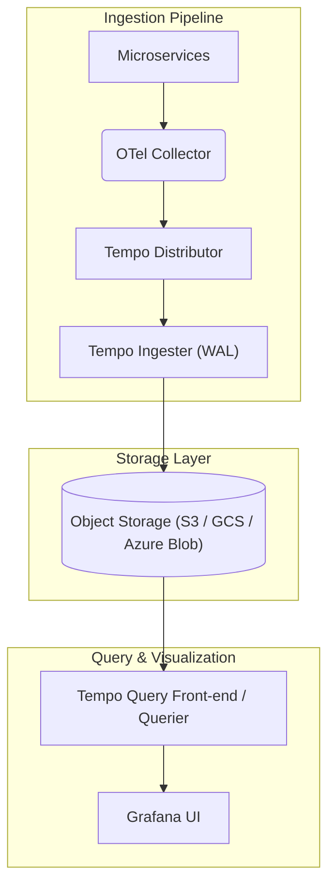
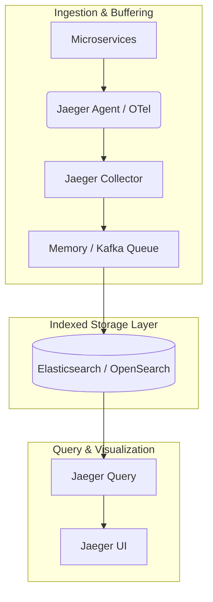
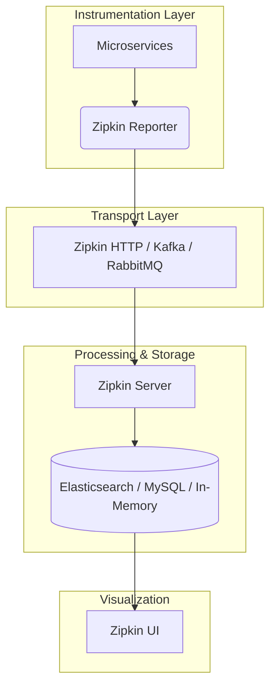

The Grafana **LGTM** stack (specifically Tempo for tracing) represents an enterprise-grade ecosystem, whereas Jaeger and Zipkin are lightweight, single-purpose tracing tools.  
## Key Differences

* Scope: Jaeger and Zipkin only handle tracing. LGTM unifies logs (Loki), graphs/dashboards (Grafana), traces (Tempo), and metrics (Mimir) into a single pane of glass.   
* Correlative Power: In LGTM, you can click on a metric spike, instantly jump to the exact logs for that millisecond, and click a link to view the cross-service trace. With Jaeger or Zipkin, you must manually copy-paste Trace IDs between different vendor tools.   
* Storage Cost: Tempo (LGTM) uses object storage (like AWS S3) which is incredibly cheap. Jaeger and Zipkin rely heavily on Elasticsearch/OpenSearch, which requires expensive, memory-heavy server clusters to maintain search indexes.  

## Comparison Matrix

| Feature | Grafana LGTM (Tempo) | Jaeger | Zipkin |
|---|---|---|---|
| Tool Footprint | Complete Observability Platform | Tracing Only | Tracing Only |
| Storage Architecture | Index-free (Object Storage / S3) | Indexed (Elasticsearch / Cassandra) | Indexed (Elasticsearch / MySQL) |
| Cost at High Volume | Very Low (Cheap storage) | High (Expensive compute/RAM) | High (Expensive compute/RAM) |
| Cross-Pillar Linking | Native (Metrics ↔ Logs ↔ Traces) | Manual (Requires external tools) | Manual (Requires external tools) |
| Search Speed | Fast via trace ID; slower for raw tags | Fast for all indexed tags | Fast for all indexed tags |
| Native Protocol | OpenTelemetry (OTel) | OTel / Jaeger Native | B3 / Zipkin Native |

## Grafana LGTM Stack (Tempo)

## Architecture Overview
The LGTM stack components (specifically Tempo for tracing) are designed as horizontally scalable microservices following a TNS (Tail-Based, No-Index, Scalable) philosophy. Instead of indexing every single trace attribute upon arrival, Tempo focuses on high-speed ingestion and bulk storage writes, relying on external service graphs or logs to locate Trace IDs.
## Under-the-Hood Components

* Distributor: The entry point. It accepts trace data in multiple formats (OpenTelemetry, Jaeger, Zipkin), validates it, and routes/shards it to the Ingesters based on the Trace ID.
* Ingester: Batches active traces into blocks in memory and writes a Write-Ahead Log (WAL) to disk to prevent data loss. Every few blocks (or after a timeout), it flushes data directly to object storage. [1] 
* Querier & Query Front-end: The Front-end cuts incoming search queries into smaller sub-queries. The Queriers then fetch block segments concurrently, either from an in-memory cache or directly from object storage.
* Storage Mechanism: Traces are bundled into heavy immutable blocks and pushed directly to object storage (like AWS S3, GCS, or Azure Blob). Tempo creates a microscopic block index file containing only the block boundaries and Trace IDs. This avoids heavy memory-mapped inverted indices.

------------------------------
## Jaeger

## Architecture Overview
Jaeger was designed by Uber around a highly indexed architecture optimized for deep topology-graph parsing and immediate query lookups across millions of trace tags. Unlike Tempo, Jaeger relies on a highly performant, stateful storage layer to indexes span details instantly.
## Under-the-Hood Components

* Jaeger Agent: A network daemon running alongside your service (often as a Kubernetes sidecar). It listens for spans over UDP, batches them, and forwards them reliably over TChannel/gRPC to the collector. [2] 
* Collector: Receives traces from agents, runs them through an internal validation pipeline, and submits them to a processing queue.
* Ingester (Optional Kafka Setup): For ultra-high loads, collectors can stream spans into an Apache Kafka cluster. A separate Jaeger Ingester service reads from Kafka and asynchronously commits the records to long-term storage.
* Jaeger Query: Fetches data directly from storage and serves a lightweight React UI.
* Storage Mechanism: Jaeger is heavily optimized for Elasticsearch, OpenSearch, or Apache Cassandra. Every single tag, process attribute, and log payload inside a span is tokenized and stored in inverted indices. This allows for near-instant searches across any custom attribute but consumes vast amounts of cluster memory and storage IOPS.

------------------------------
## Zipkin

## Architecture Overview
Zipkin is built as a highly centralized, straightforward Java application. It uses a monolithic deployment model where the ingestion framework, indexing pipelines, and query interface all live within a single running jar executable.
## Under-the-Hood Components

* Zipkin Reporter: An instrumentation library built directly inside your application code (e.g., Brave in Spring Boot). It collects local spans asynchronously and fires them out via transport protocols.
* Transport Layer: Zipkin collectors can receive raw spans directly over HTTP, but enterprise setups typically decouple this traffic using traditional message queues like RabbitMQ, Apache Kafka, or ActiveMQ.
* Zipkin Server: A Spring Boot application containing both the collection logic and the HTTP Query API. When a message arrives via a transport queue, the server decodes the Zipkin V2 JSON or Protobuf payload and hits the storage driver interface.
* Storage Mechanism: Zipkin relies primarily on Elasticsearch for production scaling, or MySQL for smaller/legacy testing setups. It structures records linearly as individual spans mapped to parent IDs. Looking up a full trace tree requires the storage backend to assemble these independent parent-child rows on demand.
 