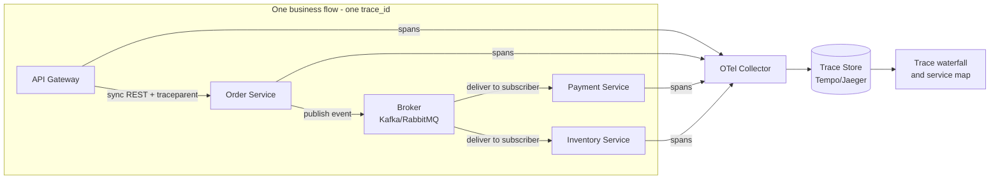
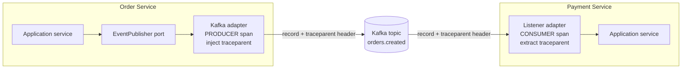

# Distributed Tracing

**Distributed tracing** follows a single logical operation (one user request or one business flow) as it travels across many services, and records it as one connected **trace**. Each unit of work along the way becomes a **span**; all spans share one `trace_id`, and each points at its caller via `parent_span_id`, so the backend can reassemble them into a tree that shows exactly where time was spent and where a failure occurred.

- **Trace** — the whole journey of one operation across services (one `trace_id`).
- **Span** — one step in that journey (a request handler, a message publish, or a message consumer). Has its own `span_id` and a `parent_span_id`.
- **Context propagation** — the mechanism that carries `trace_id`/`span_id` from one service to the next (W3C `traceparent` header over HTTP, or message headers over a broker) so the trace stays connected.

## Functional flow



Each service creates its spans locally and exports them independently to the collector. Because every span carries the shared `trace_id` — propagated over the REST hop and through the broker — the backend groups them back into a single trace and renders the waterfall and service map. No service needs to know the full picture.

## Scope

This document is deliberately narrow. It covers **only**:

- **Service-to-service** distributed tracing — the network hop between two of our services.
- **EDA message tracing** — publishers and subscribers of **command** messages and **event** messages.
- **Message loss / delivery-failure** tracing — detecting messages that were published but never processed.

**Out of scope (intentionally):**

- *Client-side tracing* — browser/mobile (RUM) and calls to backing resources such as databases, caches, and third-party APIs.
- *Internal tracing* — in-process spans for business-logic/use-case methods and background jobs.

### Command vs. event — traced differently

| | **Command** | **Event** |
|---|---|---|
| Meaning | Imperative "do this" | Fact "this happened" |
| Consumers | Exactly **one** handler | **Zero or more** subscribers |
| Example | `ChargePayment` | `OrderCreated` |
| Trace shape | Parent → child (directed) | Publish span **linked** to each subscriber's span (fan-out) |
| Loss signal | The one handler span is missing | A given subscriber's span is missing |

---

## What to trace (should-trace items)

In an event-driven system correctness is *eventually consistent*: one business transaction (e.g. *place order → charge payment → reserve stock*) is spread across many services, many messages, and moments in time. To reason about it end-to-end you must trace **every boundary the flow crosses** and stamp **the same correlation keys everywhere**, so the whole transaction can be reassembled and searched even when its messages land seconds apart in different services.

Trace these boundaries (and nothing in between — internal logic stays out of scope):

- **Every service hop** — the SERVER side (received) and the CLIENT side (sent) of a synchronous call.
- **Every message hop** — the PRODUCER side (published) and the CONSUMER side (processed) of each command and event.
- **Every delivery outcome** — broker acknowledgment, consumer ack/nack (settle), retries, and dead-lettering.

### Correlation keys every span MUST carry

Consistency of the *telemetry itself* is what makes end-to-end search possible: every service must emit the **same attribute names** (shared semantic conventions) so a single query can follow a transaction across all of them.

| Key | Scope it joins | Why it's required |
|---|---|---|
| `trace_id` | one request/flow | Reassembles a single synchronous flow into one trace |
| `span_id` / `parent_span_id` | one step + its caller | Builds the span tree and causal order |
| `messaging.message.id` | one message | Idempotency, and joins a `publish` span to its `process` span |
| `messaging.message.conversation_id` | the whole business transaction (saga) | Follows an eventually-consistent flow across many messages **and** many traces |
| `causation_id` | cause → effect | Id of the message that triggered this one; chains upstream cause to downstream effect |
| business key(s) — `order.id`, `customer.id`, `tenant.id` | one domain entity | Lets you search by *what* happened, not just by trace ids |

> `trace_id` connects a **single** flow; `conversation_id` connects **every** flow of one business transaction — a saga usually spans several traces, because each async fan-out link starts a new root. You need both.

For each item below, a JS-style span shape (JSON with unquoted keys) shows the name, kind, and the attributes worth capturing.

### 1. Inbound service request (SERVER)

The **receiving** end of a service-to-service call. A `SERVER` span at every HTTP/gRPC entry; it continues the trace from the caller's `traceparent`.

```js
{
  name: "GET /orders/{id}",
  kind: "SERVER",
  trace_id: "4bf92f3577b34da6a3ce929d0e0e4736",
  span_id: "a1b2c3d4e5f60718",
  parent_span_id: "00f067aa0ba902b7",   // from the caller's traceparent header
  attributes: {
    "http.request.method": "GET",
    "http.route": "/orders/{id}",
    "url.path": "/orders/ord_1001",
    "http.response.status_code": 200,
    "server.address": "order-service",
    "client.address": "gateway"
  }
}
```

### 2. Outbound service-to-service call (CLIENT)

The **calling** end. A `CLIENT` span for a synchronous call to another one of our services; this is where `traceparent` is injected into the outgoing request. (Only internal service-to-service calls — not DB, cache, or third-party APIs, which are out of scope.)

```js
{
  name: "GET inventory-service /stock/{sku}",
  kind: "CLIENT",
  attributes: {
    "http.request.method": "GET",
    "url.full": "http://inventory-service/stock/BOOK-01",
    "http.response.status_code": 200,
    "server.address": "inventory-service",
    "peer.service": "inventory-service"
  }
}
```

### 3. Command message — publish (PRODUCER)

Sending an imperative command to its single target handler's queue.

```js
{
  name: "publish ChargePayment",
  kind: "PRODUCER",
  attributes: {
    "messaging.system": "rabbitmq",
    "messaging.operation.type": "publish",
    "messaging.destination.name": "payment.commands",
    "messaging.message.id": "cmd_7a1b",
    "messaging.message.conversation_id": "saga_774",  // ties the whole flow together
    "message.type": "command",
    "command.name": "ChargePayment"
  }
}
```

### 4. Command message — handle (CONSUMER)

The single handler. Parent-child, because a command has exactly one intended consumer.

```js
{
  name: "process ChargePayment",
  kind: "CONSUMER",
  parent_span_id: "00f067aa0ba902b7",   // from the command's traceparent
  attributes: {
    "messaging.system": "rabbitmq",
    "messaging.operation.type": "process",
    "messaging.destination.name": "payment.commands",
    "messaging.message.id": "cmd_7a1b",
    "messaging.message.conversation_id": "saga_774",
    "message.type": "command",
    "command.name": "ChargePayment"
  }
}
```

### 5. Event message — publish (PRODUCER)

Broadcasting a fact. One publish span, regardless of how many subscribers exist.

```js
{
  name: "publish orders.created",
  kind: "PRODUCER",
  attributes: {
    "messaging.system": "kafka",
    "messaging.operation.type": "publish",
    "messaging.destination.name": "orders.created",
    "messaging.message.id": "evt_9f2c1a",
    "messaging.message.conversation_id": "saga_774",
    "message.type": "event",
    "event.name": "OrderCreated"
  }
}
```

### 6. Event message — subscribe / consume (CONSUMER)

One span **per subscriber**. For fan-out, use a **link** to the publish span (rather than parent-child) so each subscriber's processing is its own trace, correlated back to the single publish.

```js
{
  name: "process orders.created",
  kind: "CONSUMER",
  parent_span_id: null,                  // fan-out: linked, not parented
  links: [
    {
      trace_id: "4bf92f3577b34da6a3ce929d0e0e4736",   // the publish span's trace
      span_id: "00f067aa0ba902b7"                     // the publish span
    }
  ],
  attributes: {
    "messaging.system": "kafka",
    "messaging.operation.type": "process",
    "messaging.destination.name": "orders.created",
    "messaging.kafka.consumer.group": "payment-service",
    "message.type": "event",
    "event.name": "OrderCreated"
  }
}
```

## 7. Message loss / delivery-failure tracing

The hardest failure in an EDA is a **silent** one: a message is published but never processed (broker down, consumer offline, wrong routing/binding, filtered, or crashed mid-handle). Tracing makes this visible by (a) emitting spans at each delivery checkpoint and (b) correlating publish and process spans by `messaging.message.id`.

**Detection rule:** a `publish` span with **no matching `process` span** (same `messaging.message.id`) within the SLA window means the message was lost or is stuck.

### 7a. Broker acknowledgment (publish confirm)

Confirm the publish so an **unconfirmed publish** is visible as loss *before* the broker (Kafka producer `acks`, RabbitMQ publisher confirms).

```js
{
  name: "publish orders.created",
  kind: "PRODUCER",
  status: "ERROR",                             // confirm never arrived
  attributes: {
    "messaging.system": "kafka",
    "messaging.operation.type": "publish",
    "messaging.destination.name": "orders.created",
    "messaging.message.id": "evt_9f2c1a",
    "messaging.kafka.acknowledgment": "all",   // durability requested
    "messaging.delivery.confirmed": false      // broker did NOT ack -> lost at publish
  },
  events: [
    { name: "publish_timeout", time: "2026-07-30T10:15:31Z",
      attributes: { reason: "no_broker_ack", timeout_ms: 3000 } }
  ]
}
```

### 7b. Consumer acknowledgment (settle)

The consumer's ack/nack back to the broker. A missing `settle` after `process` means the message may be redelivered or stuck unacked.

```js
{
  name: "settle payment.order-created",
  kind: "CONSUMER",
  attributes: {
    "messaging.system": "rabbitmq",
    "messaging.operation.type": "settle",       // ack | nack | reject
    "messaging.destination.name": "payment.order-created",
    "messaging.rabbitmq.message.delivery_tag": 42,
    "messaging.settle.outcome": "nack",
    "messaging.message.id": "evt_9f2c1a"
  }
}
```

### 7c. Dead-letter queue (loss after retries)

A **dead-letter queue (DLQ)** is where the broker parks a message that could not be processed after its retry budget is spent — a poison message, a repeatedly failing handler, an expired TTL, or an overflowing queue. A message silently sliding into a DLQ is one of the most common invisible failures in an EDA. Mark the failing `process` span with the dead-letter attributes below so exhausted/poison messages are queryable, and record *why* it was dead-lettered as a span event.

Keep the DLQ trace connected: the dead-lettered span must keep the **same `messaging.message.id` and `conversation_id`** as the original, so that when the message is later **replayed from the DLQ** it links back to the original failure instead of appearing as a brand-new, unrelated flow.

```js
{
  name: "process orders.created",
  kind: "CONSUMER",
  status: "ERROR",
  attributes: {
    "messaging.system": "rabbitmq",
    "messaging.operation.type": "process",
    "messaging.destination.name": "payment.order-created",
    "messaging.message.id": "evt_9f2c1a",
    "messaging.redelivered": true,
    "messaging.delivery_attempts": 5,
    "messaging.dead_letter": true,
    "messaging.dead_letter.queue": "payment.order-created.dlq"
  },
  events: [
    { name: "message_dead_lettered", time: "2026-07-30T10:16:00Z",
      attributes: { reason: "max_retries_exceeded", "exception.type": "PaymentGatewayTimeout" } }
  ]
}
```

### How to surface losses

- **Publish-without-process** — find `messaging.message.id` values that have a `publish` span but no `process` span in the SLA window. These are lost or stuck in flight.
- **Unconfirmed publishes** — `messaging.delivery.confirmed: false` (7a) catches loss between producer and broker.
- **Poison messages** — `messaging.redelivered: true` with rising `messaging.delivery_attempts`, ending in `messaging.dead_letter: true` (7c).
- **Backlog (loss risk)** — pair traces with Kafka consumer-lag / RabbitMQ queue-depth metrics; a widening gap between publish and process timestamps signals a backing-up or offline consumer.
- **Fan-out gaps** — for events, an expected subscriber whose `process` span never links back to the publish means that one consumer group missed the message while others got it (a binding/subscription problem).

---

## Best practices — trace for end-to-end search and deep root-cause

The goal: given only a customer complaint or an alert, you type **one value** into the trace UI and pull up the **entire** business transaction across every service and message, then drill straight to the exact span that failed and see *why*. That only works when instrumentation is consistent and the right keys are always present.

### 1. Make the telemetry consistent across services

- **One shared attribute catalog.** Every service emits the same attribute names (OpenTelemetry semantic conventions plus a small agreed set of business keys). Naming drift — `orderId` in one service, `order.id` in another — silently breaks cross-service search.
- **Propagate on every hop.** W3C `traceparent`/`tracestate` on HTTP, and the same headers on Kafka records and AMQP properties. A single un-propagated hop splits one trace into two.
- **Carry `conversation_id` and `causation_id` in the message envelope/headers**, not only on spans, so the next service can re-stamp them onto its own spans.
- **Synchronized clocks (NTP).** Async spans land seconds apart on different hosts; clock skew makes the waterfall lie about ordering and duration.

### 2. The "must-trace" key set (guarantee these on every relevant span)

- **Identity / correlation:** `trace_id`, `span_id`, `parent_span_id`, `messaging.message.id`, `messaging.message.conversation_id`, `causation_id`.
- **Business:** `order.id`, `customer.id` (pseudonymized), `tenant.id`, `event.name` / `command.name`, `event.version`, `aggregate.id` / `aggregate.type`.
- **Delivery / reliability:** `messaging.system`, `messaging.operation.type`, `messaging.destination.name`, consumer group / routing key, `messaging.delivery.confirmed`, `messaging.redelivered`, `messaging.delivery_attempts`, `messaging.dead_letter` (+ queue), `messaging.settle.outcome`.
- **Outcome:** span `status` (OK/ERROR), and `exception.type` / `exception.message` / `exception.stacktrace` recorded as span events on the span that actually failed.

### 3. Query recipes these keys unlock

| To answer... | Search on... |
|---|---|
| Follow one transaction end-to-end | `conversation_id = saga_774` → every service, message, retry, and DLQ hop, across separate traces |
| Cause → effect chain | walk `causation_id` to see which upstream message produced the one that failed |
| Find a silently lost message | `messaging.message.id` with a `publish` but no `process` span in the SLA window |
| Blast radius of a bad event | `event.name = OrderCreated AND status = ERROR`, grouped by consumer group |
| Detect duplicate / replayed work | the same `messaging.message.id` on more than one successful `process` span (idempotency breach) |
| Root-cause a deep failure | open the transaction, jump to the single `ERROR` span, read its `exception.*` event in place |

### 4. Record failures where they happen

Set `status = ERROR` and attach the exception **on the span that actually failed**, not on the root. Let the error surface outward as ERROR status on parent spans so the UI highlights the whole failing path, but keep the stack trace on the origin span so root cause is one click from the red node — no log hunting.

### Definition of done (per service)

- [ ] Context propagated on every inbound/outbound hop (HTTP + broker).
- [ ] PRODUCER/CONSUMER spans on every publish/process, with the correct span kind.
- [ ] `messaging.message.id`, `conversation_id`, and `causation_id` present on every messaging span.
- [ ] Business keys (`order.id`, `customer.id`, `tenant.id`) present on entry and messaging spans.
- [ ] Broker ack, consumer settle, retries, and dead-letter outcomes traced.
- [ ] Exceptions recorded as span events with `status = ERROR` on the failing span.
- [ ] Attribute names match the shared catalog (no per-service naming drift).

---

# Distributed Message & Event Tracing in an EDA (Spring Boot + Kafka/RabbitMQ)

This plan covers how to trace an event as it crosses service boundaries through a broker, so one logical business flow (e.g. *place order → charge payment → reserve stock*) shows up as **a single connected trace** even though it spans many services and async hops.

## The core idea

A trace stays connected across services because the **trace context travels with the message**. OpenTelemetry serializes the active context into two W3C headers and attaches them to the message:

- **`traceparent`** — carries the `trace_id`, the producing `span_id`, and sampling flags.
- **`tracestate`** — optional vendor key/values.

Format of `traceparent`:

```text
00 - 4bf92f3577b34da6a3ce929d0e0e4736 - 00f067aa0ba902b7 - 01
|         |                                |                 |
version   trace_id (16 bytes, hex)         parent span_id    flags (01 = sampled)
```

The consumer reads `traceparent`, so its new span inherits the **same `trace_id`** and points at the producer's `span_id` as parent. Every service gets its own `span_id` but shares one `trace_id` — that is what stitches the distributed trace together (see the `trace_id` vs `span_id` explanation in the observability design doc).



## Building blocks

| # | Building block | Responsibility | Where it lives (clean architecture) |
|---|---|---|---|
| 1 | Event envelope schema | Stable contract + carries metadata | Shared contract module / domain event |
| 2 | Producer adapter | Serialize event, start PRODUCER span, **inject** context into headers | Infrastructure (outbound adapter) |
| 3 | Broker | Transports headers untouched | Kafka / RabbitMQ |
| 4 | Consumer adapter | **Extract** context, start CONSUMER span, map to command | Infrastructure (inbound adapter) |
| 5 | Application/domain | Pure business logic, no OTel imports | Application + Domain |
| 6 | Collector + backend | Receive OTLP, batch, sample, store | Platform |

The golden rule for clean architecture: **all tracing code lives in the infrastructure adapters.** The domain publishes and consumes plain events through ports and never imports an OpenTelemetry type.

---

## 1. Event envelope schema

Keep the **trace context in the transport headers, not in the business payload** — the domain event should stay clean. The envelope below shows the payload; the trace headers are shown separately in blocks 3.

```js
// Domain event payload (business data only — no tracing fields)
{
  eventId: "evt_9f2c1a",               // unique id, also used for idempotency
  eventType: "order.created",          // used for routing + semantics
  eventVersion: "1.0",
  occurredAt: "2026-07-30T10:15:30Z",
  producer: "order-service",
  data: {
    orderId: "ord_1001",
    customerId: "cust_55",
    amount: 42.50,
    currency: "USD",
    items: [
      { sku: "BOOK-01", qty: 1, price: 42.50 }
    ]
  }
}
```

---

## 2. Dependencies & configuration (recommended: let Spring propagate)

In Spring Boot 3, Micrometer Observation + the Micrometer→OTel bridge handles injection/extraction for you. You just add the bridge and **turn observation on** for the messaging components.

```gradle
// build.gradle
dependencies {
    implementation 'org.springframework.boot:spring-boot-starter-actuator'

    // Micrometer Observation -> OpenTelemetry bridge + OTLP exporter
    implementation 'io.micrometer:micrometer-tracing-bridge-otel'
    implementation 'io.opentelemetry:opentelemetry-exporter-otlp'

    // Messaging
    implementation 'org.springframework.kafka:spring-kafka'
    implementation 'org.springframework.boot:spring-boot-starter-amqp'
}
```

```yaml
# application.yml
management:
  tracing:
    sampling:
      probability: 1.0          # 100% in dev; lower (e.g. 0.1) in prod, or use tail sampling at the collector
  otlp:
    tracing:
      endpoint: http://otel-collector:4318/v1/traces

spring:
  kafka:
    template:
      observation-enabled: true   # producer side: inject traceparent into record headers
    listener:
      observation-enabled: true   # consumer side: extract traceparent, start CONSUMER span
  rabbitmq:
    template:
      observation-enabled: true
    listener:
      simple:
        observation-enabled: true
```

With this in place, the code in blocks 4–5 needs **zero tracing code** — Spring instruments `KafkaTemplate`/`RabbitTemplate` and `@KafkaListener`/`@RabbitListener` automatically. Blocks 3 and the "manual" variants below show what happens under the hood, and how to do it when you have a producer/consumer Spring does not manage.

---

## 3. What the message looks like on the wire (headers carry the context)

**Kafka** — context rides in record headers:

```js
// Kafka ProducerRecord: key, value (JSON), and headers
{
  topic: "orders.created",
  key: "ord_1001",
  value: "{ ...the event envelope from block 1... }",
  headers: {
    traceparent: "00-4bf92f3577b34da6a3ce929d0e0e4736-00f067aa0ba902b7-01",
    tracestate: "congo=t61rcWkgMzE",
    "content-type": "application/json",
    eventType: "order.created",
    eventId: "evt_9f2c1a"
  }
}
```

**RabbitMQ** — context rides in the AMQP `headers` property:

```js
// AMQP message: properties + body
{
  properties: {
    messageId: "evt_9f2c1a",
    contentType: "application/json",
    headers: {
      traceparent: "00-4bf92f3577b34da6a3ce929d0e0e4736-00f067aa0ba902b7-01",
      tracestate: "congo=t61rcWkgMzE",
      eventType: "order.created"
    }
  },
  routingKey: "order.created",
  exchange: "orders.exchange",
  body: "{ ...the event envelope from block 1... }"
}
```

---

## 4. Producer adapter

**Clean architecture:** the application layer depends only on a port; the Kafka details and tracing live in the adapter.

```java
// application/port/out/EventPublisher.java  (application layer — no OTel, no Kafka)
public interface EventPublisher {
    void publish(DomainEvent event);
}
```

### Recommended (auto) — observation does the injection

```java
// infrastructure/messaging/KafkaEventPublisher.java
@Component
class KafkaEventPublisher implements EventPublisher {

    private final KafkaTemplate<String, String> kafka;   // observation-enabled via application.yml
    private final ObjectMapper mapper;

    KafkaEventPublisher(KafkaTemplate<String, String> kafka, ObjectMapper mapper) {
        this.kafka = kafka;
        this.mapper = mapper;
    }

    @Override
    public void publish(DomainEvent event) {
        String json = toJson(event);
        // KafkaTemplate is observation-enabled, so a PRODUCER span is created
        // and traceparent is injected into the record headers automatically.
        kafka.send("orders.created", event.aggregateId(), json);
    }

    private String toJson(DomainEvent event) { /* map to envelope + serialize */ }
}
```

### Manual (under the hood) — explicit span + context injection

Use this when you manage a raw producer yourself, or need custom span attributes.

```java
private static final TextMapSetter<Headers> KAFKA_SETTER =
    (headers, key, value) -> headers.add(key, value.getBytes(StandardCharsets.UTF_8));

public void publish(DomainEvent event) {
    Tracer tracer = openTelemetry.getTracer("order-service");

    Span span = tracer.spanBuilder("publish orders.created")   // "<operation> <destination>"
        .setSpanKind(SpanKind.PRODUCER)
        .setAttribute("messaging.system", "kafka")
        .setAttribute("messaging.destination.name", "orders.created")
        .setAttribute("messaging.operation.type", "publish")
        .setAttribute("messaging.message.id", event.eventId())
        .startSpan();

    try (Scope scope = span.makeCurrent()) {
        var record = new ProducerRecord<>("orders.created", event.aggregateId(), toJson(event));

        // inject the current W3C context into the Kafka headers
        openTelemetry.getPropagators().getTextMapPropagator()
            .inject(Context.current(), record.headers(), KAFKA_SETTER);

        kafka.send(record);
    } catch (Exception e) {
        span.recordException(e);
        span.setStatus(StatusCode.ERROR);
        throw e;
    } finally {
        span.end();
    }
}
```

---

## 5. Consumer adapter

The listener is an **inbound adapter**: extract context, open a CONSUMER span, then delegate to the application service with a plain command.

### Recommended (auto)

```java
// infrastructure/messaging/OrderCreatedListener.java
@Component
class OrderCreatedListener {

    private final ChargePaymentUseCase chargePayment;   // application port
    private final ObjectMapper mapper;

    @KafkaListener(topics = "orders.created", groupId = "payment-service")
    public void onMessage(String payload) {
        // Listener is observation-enabled: traceparent is extracted from headers
        // and a CONSUMER span (child of the producer span) is already active here.
        OrderCreatedEvent event = fromJson(payload);
        chargePayment.charge(new ChargeCommand(event.orderId(), event.amount()));
    }
}
```

### Manual (under the hood) — explicit extraction + span

```java
private static final TextMapGetter<Headers> KAFKA_GETTER = new TextMapGetter<>() {
    public Iterable<String> keys(Headers headers) {
        return () -> StreamSupport.stream(headers.spliterator(), false)
                                  .map(Header::key).iterator();
    }
    public String get(Headers headers, String key) {
        Header h = headers.lastHeader(key);
        return h == null ? null : new String(h.value(), StandardCharsets.UTF_8);
    }
};

@KafkaListener(topics = "orders.created", groupId = "payment-service")
public void onMessage(ConsumerRecord<String, String> record) {
    // 1) rebuild the context sent by the producer
    Context extracted = openTelemetry.getPropagators().getTextMapPropagator()
        .extract(Context.current(), record.headers(), KAFKA_GETTER);

    // 2) start the CONSUMER span as a child of the producer span (same trace_id)
    Span span = openTelemetry.getTracer("payment-service")
        .spanBuilder("process orders.created")
        .setParent(extracted)
        .setSpanKind(SpanKind.CONSUMER)
        .setAttribute("messaging.system", "kafka")
        .setAttribute("messaging.operation.type", "process")
        .setAttribute("messaging.destination.name", "orders.created")
        .setAttribute("messaging.kafka.consumer.group", "payment-service")
        .startSpan();

    try (Scope scope = span.makeCurrent()) {
        OrderCreatedEvent event = fromJson(record.value());
        chargePayment.charge(new ChargeCommand(event.orderId(), event.amount()));
    } catch (Exception e) {
        span.recordException(e);
        span.setStatus(StatusCode.ERROR);
        throw e;   // let the error retry/DLQ path run; the span records the failure
    } finally {
        span.end();
    }
}
```

### RabbitMQ variant

Same pattern, different header carrier. Producer injects into `MessageProperties.getHeaders()`; consumer extracts from it.

```java
// Producer: inject into AMQP headers via a MessagePostProcessor
rabbitTemplate.convertAndSend("orders.exchange", "order.created", json, message -> {
    Map<String, Object> headers = message.getMessageProperties().getHeaders();
    openTelemetry.getPropagators().getTextMapPropagator()
        .inject(Context.current(), headers, (h, k, v) -> h.put(k, v));
    return message;
});

// Consumer: extract from AMQP headers
@RabbitListener(queues = "payment.order-created")
public void onMessage(Message message) {
    Map<String, Object> headers = message.getMessageProperties().getHeaders();
    Context extracted = openTelemetry.getPropagators().getTextMapPropagator()
        .extract(Context.current(), headers, RABBIT_GETTER);   // reads String header values
    // ... start CONSUMER span with setParent(extracted), same as Kafka ...
}
```

---

## 6. Messaging span attributes (semantic conventions)

Set these on producer/consumer spans so every backend understands them the same way.

| Attribute | Example | Notes |
|---|---|---|
| `messaging.system` | `kafka` / `rabbitmq` | Broker type |
| `messaging.operation.type` | `publish` / `receive` / `process` | The role of this span |
| `messaging.destination.name` | `orders.created` | Topic (Kafka) / exchange or queue (Rabbit) |
| `messaging.message.id` | `evt_9f2c1a` | Your event id |
| `messaging.message.conversation_id` | `saga_774` | Correlates multi-message flows (sagas) |
| `messaging.kafka.consumer.group` | `payment-service` | Kafka only |
| `messaging.kafka.message.key` | `ord_1001` | Kafka only |
| `messaging.rabbitmq.destination.routing_key` | `order.created` | RabbitMQ only |

Span naming convention: `{operation} {destination}` → `publish orders.created`, `process orders.created`. Span kinds: **PRODUCER** on publish, **CONSUMER** on receive/process.

---

## 7. Collector (minimal)

```yaml
# otel-collector.yaml
receivers:
  otlp:
    protocols:
      http:
      grpc:
processors:
  batch: {}
  tail_sampling:            # keep all errors + slow traces, sample the rest
    policies:
      - name: errors
        type: status_code
        status_code: { status_codes: [ERROR] }
      - name: slow
        type: latency
        latency: { threshold_ms: 1000 }
exporters:
  otlp/tempo:
    endpoint: tempo:4317
    tls: { insecure: true }
service:
  pipelines:
    traces:
      receivers: [otlp]
      processors: [batch, tail_sampling]
      exporters: [otlp/tempo]
```

---

## Best practices checklist

- **Context in headers, not payload.** Keep `traceparent`/`tracestate` as message headers so the domain event contract stays clean and versionable.
- **Enable observation on both ends.** For Kafka set `observation-enabled: true` on *both* template and listener; for RabbitMQ on template and `listener.simple`. Missing one end breaks the trace.
- **Correct span kinds.** PRODUCER on publish, CONSUMER on receive/process — backends use this to draw the async gap correctly.
- **Batch consumers → use span links.** When a listener pulls a batch, create one `process` span per message, each **linked** to its own producer span, under a single `receive` span. Parent-child alone can't model many-to-one.
- **Keep the domain pure.** Tracing lives only in infrastructure adapters. The application service receives a plain command and has no idea a broker or OTel exists.
- **Record failures on the span.** `recordException` + set status ERROR before rethrowing so retries/DLQ hops are visible in the trace.
- **Propagate across async threads.** If you hand work to an `@Async` method or a thread pool, wrap it so the OTel context follows (Micrometer context propagation / `Context.taskWrapping(executor)`); otherwise the child span detaches.
- **Sampling.** Head-based sampling decided at the producer flows via the `traceparent` flags to all consumers (consistent sampling). Add tail sampling at the collector to always keep errors and slow traces.
- **No PII in attributes.** Use ids (`customerId`), never names/emails/card numbers, in span attributes or event headers.
- **Idempotency key = trace-friendly.** Carry `eventId` as both `messaging.message.id` and your dedup key so a replayed message is identifiable in traces.
- **Use `conversation_id` for sagas.** Stamp a business correlation id across every message in a multi-step flow so you can query the whole saga even across separate traces.